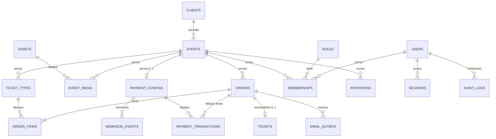

# DRD — Technical Requirements: Uncle (Platform Ticketing Event White-Label)

> **Sumber:** `uncle-overview.md`, `PRD.md`, `UI-UX.md`, ditambah keputusan
> arsitektur kunci dari brief DRD. Rekomendasi teknis yang belum final ditandai
> **"Rekomendasi"** beserta alasannya. Semua pertanyaan terbuka dikumpulkan di
> bagian **Pertanyaan Terbuka** di akhir dokumen.
>
> **Status:** Draft v1.3 · **Tanggal:** 7 Oktober 2026 · **Scope:** MVP
>
> **Perubahan v1.1 (patch dari v1, 6 Okt 2026):** hosting final (D5 — Tech
> Stack §2, Deployment, Integrations §3); batas reservasi Cash mengikuti
> overview terbaru (D6 — §Database 5.2); endpoint baru "buat pesanan baru dari
> reservasi kedaluwarsa" (D7 — API §5); T6 & T7 dihapus dari Pertanyaan Terbuka
> karena sudah diputuskan; pertanyaan teknis baru T18–T22.
>
> **Perubahan v1.2:** `events.ends_at` wajib (overview: Jam Selesai wajib,
> default Jam Mulai + 3 jam di form); fallback "mulai + 4 jam" dihapus; T20
> terjawab dan dihapus.
>
> **Perubahan v1.3:** target rewrite landing page diganti dari `/_sites/{slug}`
> menjadi `/sites/{slug}` (folder `src/app/sites/[slug]`), karena di Next.js
> App Router folder berawalan `_` adalah private folder dan tidak membentuk
> route. Akses langsung ke `/sites/*` dari host selain `{slug}.uncle.id` → 404
> (Architecture §1 & §4). Disetujui pemilik project; lihat `AI-CODING-RULES.md`.

> **⚠️ Keputusan baru dari brief DRD yang mengubah dokumen sebelumnya**
>
> | # | Keputusan baru | Dampak ke dokumen lama |
> |---|---|---|
> | D1 | **Email customer wajib** (QR Tiket wajib dikirim via email). | Menggantikan asumsi "email opsional" di PRD BR-TRX-03 / LP-07 dan UI-UX Step 2. Menjawab PRD Q1. |
> | D2 | **Cash = status `RESERVED` dengan batas waktu**, bukan langsung Lunas; reservasi yang kedaluwarsa **melepas kuota**. | Menggantikan PRD BR-TRX-08 ("kuota baru kembali jika admin membatalkan"). Scanner butuh hasil baru "Reservasi kedaluwarsa". Menjawab sebagian PRD Q3. |
> | D3 | **1 event = 1 tenant**; kredensial QRIS per tenant, diinput sendiri oleh client. | Mengonfirmasi PRD BR-PAY-02; menjawab sebagian PRD Q7 (kredensial per event). |
> | D4 | Uncle **tidak memproses refund finansial**, hanya menandai status `CANCELLED` / `REFUNDED`. | Mengonfirmasi asumsi PRD BR-RFD-01/03; menjawab sebagian PRD Q2. |
> | D5 | **Hosting final:** Vercel Pro · Supabase Pro (Postgres + Storage, Singapore) · Cloudflare Free (DNS) · Resend Free (naik paket sesuai volume). Data pembeli boleh disimpan di Singapura. | Menggantikan rekomendasi Neon / Cloudflare R2. Menjawab T6 & T7 (dihapus). Lihat Tech Stack §2 & Deployment. |
> | D6 | **Batas reservasi Cash default = jam selesai event** (bukan H-1, bukan jam mulai); Owner bisa mempercepat per event. | Mengganti default `UNTIL_EVENT_START` di §Database 5.2. Sejalan dengan PRD v1.1 BR-TRX-08. Menjawab sebagian T5. |
> | D7 | Scan reservasi Cash kedaluwarsa → admin bisa **membuat pesanan baru berstatus Lunas** dengan data yang sama bila kuota masih ada. | Endpoint baru `…/orders/{orderId}/reissue` (API §5), kolom `orders.reissued_from_order_id`. Sejalan dengan PRD SCN-08 / BR-TKT-07 & UI-UX Scan (k). |
>
> `PRD.md` dan `UI-UX.md` sudah disesuaikan dengan D1, D2, D6, D7 di v1.1
> (kecuali yang tercatat di Pertanyaan Terbuka B).

---

## Architecture

### 1. Gambaran Besar

Uncle dibangun sebagai **modular monolith**: satu aplikasi web (frontend +
backend API) satu codebase, satu database PostgreSQL, ditambah layanan eksternal
terkelola. *Rekomendasi* — alasan: tim kecil/solo developer, satu deployment,
transaksi database tunggal untuk alur kritis (kuota ↔ order ↔ pembayaran), dan
belum ada kebutuhan skala yang membenarkan microservices.

```
                         ┌──────────────────────────── INTERNET ────────────────────────────┐
                         │                                                                   │
   Customer (HP)         │   Owner (laptop)          Admin/Client (laptop & HP)              │
   teaterbagol.uncle.id  │   app.uncle.id/owner      app.uncle.id/admin/{eventId}            │
        │                │        │                  app.uncle.id/admin/{eventId}/scan       │
        └────────────────┴────────┴──────────────┬────────────────────────────────────────────┘
                                                 │ HTTPS (TLS otomatis Vercel, lihat Deployment §3)
                                                 ▼
                         ┌───────────────────────────────────────────────┐
                         │  DNS Cloudflare → Vercel Pro Edge (sin1)       │
                         └───────────────────────┬───────────────────────┘
                                                 ▼
┌──────────────────────────────────────────────────────────────────────────────────────────┐
│                         UNCLE WEB APP (Next.js, modular monolith)                         │
│                                                                                          │
│  ┌──────────────── Edge Middleware: Host-based routing & tenant resolution ────────────┐ │
│  │  {slug}.uncle.id  → rewrite ke /sites/{slug}/…    (Landing Page + Public API)       │ │
│  │  app.uncle.id     → /owner/…, /admin/{eventId}/…, /api/…                            │ │
│  │  uncle.id, www    → halaman marketing Uncle                                         │ │
│  └─────────────────────────────────────────────────────────────────────────────────────┘ │
│                                                                                          │
│  Presentation:  Landing Page │ Owner Dashboard │ Admin Dashboard │ Scanner (mobile web)  │
│  ─────────────────────────────────────────────────────────────────────────────────────── │
│  REST API:  /api/public/*  │ /api/auth/* │ /api/owner/* │ /api/admin/events/{id}/*        │
│             /api/webhooks/payments/{provider}/{webhookKey} │ /api/internal/cron/*         │
│  ─────────────────────────────────────────────────────────────────────────────────────── │
│  Domain modules:                                                                         │
│   identity (user, session, invite) · tenancy (event, membership) · catalog (ticket type) │
│   ordering (order, quota allocation) · payments (gateway adapter, webhook inbox)         │
│   ticketing (QR tiket, check-in) · notifications (email outbox) · audit · media           │
│  ─────────────────────────────────────────────────────────────────────────────────────── │
│  Data access: TenantScopedRepository (wajib event_id) → PostgreSQL (+ RLS)               │
└───────┬───────────────┬────────────────┬──────────────────┬──────────────────┬───────────┘
        │               │                │                  │                  │
        ▼               ▼                ▼                  ▼                  ▼
┌──────────────┐ ┌─────────────┐ ┌──────────────┐ ┌──────────────────┐ ┌──────────────────┐
│ PostgreSQL   │ │ Redis       │ │ Supabase     │ │ Email Provider   │ │ Payment Gateway  │
│ Supabase Pro │ │ (rate limit,│ │ Storage +    │ │ (Resend)         │ │ (Tripay, QRIS    │
│ (Singapore)  │ │ cache kecil)│ │ CDN (SG)     │ │ + bounce webhook │ │ dinamis) — akun  │
└──────────────┘ └─────────────┘ └──────────────┘ └──────────────────┘ │ MILIK TIAP CLIENT│
        ▲                                                              └────────┬─────────┘
        │                    ┌───────────────────────────┐                      │
        └────────────────────│ Scheduler (Cron tiap 1 mnt)│      webhook (callback)
                             │ expire order, kirim email, │◄─────────────────────┘
                             │ rekonsiliasi QRIS          │   POST /api/webhooks/payments/
                             └───────────────────────────┘        tripay/{webhookKey}
```

### 2. Pembagian Host & Permukaan

| Host | Permukaan | Isi | Auth |
|---|---|---|---|
| `{slug}.uncle.id` | Landing Page + Public API | Halaman event, checkout, Cek Pesanan; `/api/public/*` (tenant diambil dari Host) | Tanpa login (guest) |
| `app.uncle.id/owner/*` | Owner Dashboard | Kelola event, tiket, branding, slug, invite admin, report | Session Owner |
| `app.uncle.id/admin/{eventId}/*` | Admin Dashboard | Transaksi, Payment Settings | Session Admin dengan membership ke `eventId` |
| `app.uncle.id/admin/{eventId}/scan` | Scanner (mobile web) | Kamera + scan QR Tiket | Sama seperti Admin |
| `app.uncle.id/api/webhooks/*` | Webhook endpoint | Callback payment gateway & email provider | Signature (bukan session) |
| `uncle.id`, `www.uncle.id` | Marketing | Profil Uncle | — |

**Subdomain cadangan** (tidak boleh dipakai sebagai slug): `app`, `api`, `www`,
`admin`, `owner`, `mail`, `email`, `staging`, `dev`, `status`, `cdn`, `assets`,
`static`, `help`, `docs`, `blog`.

*Rekomendasi:* dashboard dipisah ke `app.uncle.id` (bukan path di subdomain
event) supaya cookie session dashboard **tidak pernah** dikirim ke host landing
page, dan satu admin bisa login sekali walaupun kelak memegang lebih dari satu
event.

### 3. Penerapan Multi-Tenancy (1 event = 1 tenant)

| Aspek | Keputusan |
|---|---|
| Model | **Shared database, shared schema, kolom tenant.** Tabel `events` adalah tabel tenant; setiap tabel data tenant punya kolom `event_id NOT NULL`. |
| Alasan *(Rekomendasi)* | Jumlah tenant diperkirakan puluhan–ratusan event; schema-per-tenant atau DB-per-tenant menambah beban migrasi & operasional tanpa manfaat berarti untuk tim kecil. Isolasi dijaga di 4 lapis (di bawah). |
| Lapis 1 — Routing | Tenant publik ditentukan dari **Host header** (`slug`), tenant admin dari **path** `/admin/{eventId}`. Tidak ada parameter tenant dari body request. |
| Lapis 2 — Otorisasi | Middleware memverifikasi `membership(user, eventId, role)` sebelum handler jalan (lihat Authentication / Authorization). |
| Lapis 3 — Query | Semua akses data tenant lewat `TenantScopedRepository` yang **mewajibkan** `eventId` dan otomatis menambahkan `WHERE event_id = $eventId`. Query tanpa tenant context ditolak saat runtime (throw) dan dicegah lint rule. |
| Lapis 4 — Database | **Composite foreign key** `(event_id, id)` mencegah relasi lintas tenant (mis. order_item event A menunjuk ticket_type event B). *Rekomendasi:* **PostgreSQL Row-Level Security (RLS)** sebagai jaring pengaman: `SET LOCAL app.event_id` per transaksi. |
| Owner | Owner melewati scope tenant hanya lewat `OwnerRepository` khusus (read lintas tenant, dicatat di audit log). |

### 4. Subdomain Routing (alur request)

```
GET https://teaterbagol.uncle.id/
 1. DNS  *.uncle.id  → Vercel (wildcard CNAME di Cloudflare, DNS-only)
 2. TLS  sertifikat per host diterbitkan otomatis oleh Vercel (lihat Deployment §3)
 3. Middleware baca Host = "teaterbagol.uncle.id"
      ├─ host ∈ {app, www, apex}        → routing normal
      ├─ subdomain ∈ daftar cadangan    → 404
      └─ selain itu: slug = "teaterbagol" → rewrite ke /sites/teaterbagol
         (route src/app/sites/[slug]; request langsung ke path /sites/* dari
          host app/www/apex → 404, supaya landing hanya bisa diakses via subdomain)
 4. Server: SELECT event WHERE slug = 'teaterbagol' AND status IN ('ACTIVE','FINISHED')
      ├─ tidak ada / DRAFT → halaman "Event tidak ditemukan" (HTTP 404)
      └─ ada → render landing (konten di-cache; kuota diambil dinamis)
 5. Browser memanggil /api/public/... di host yang SAMA (same-origin, tanpa CORS)
```

- Halaman landing di-cache di CDN (ISR/revalidate) dan **di-invalidate saat
  Owner menyimpan event** (`revalidateTag("event:{id}")`). Data kuota tersisa
  tidak di-cache (diambil via API dengan `Cache-Control: no-store` atau
  cache ≤ 5 detik). *Rekomendasi.*
- Mapping slug → eventId di-cache singkat (60 detik) di memori/Redis.

### 5. Alur Kritis End-to-End

#### 5.1 Checkout QRIS

```
Customer          Landing/API                 DB                     Tripay (akun client)
   │ pilih tiket, isi data, QRIS                │                            │
   │──POST /api/public/orders (Idempotency-Key)►│                            │
   │                 │ BEGIN                     │                            │
   │                 │ lock ticket_types (FOR UPDATE, urut id)                │
   │                 │ lepas hold kedaluwarsa (sweep-on-write)                │
   │                 │ cek & tambah allocated_count (CHECK ≤ quota)           │
   │                 │ INSERT order (PENDING_PAYMENT, expires_at = now+15m)   │
   │                 │ COMMIT                    │                            │
   │                 │──create transaction (QRIS, amount, merchant_ref)──────►│
   │                 │◄────────────── qr_string, reference, expired_time ────│
   │                 │ INSERT payment_transaction (UNPAID)                    │
   │◄── 201 {order, payment.qr_string, expires_at, access_token} ──│          │
   │ tampil QR pembayaran, polling GET /orders/{code} tiap 3 dtk   │          │
   │ bayar via e-wallet/m-banking ─────────────────────────────────────────►  │
   │                 │◄──── POST /api/webhooks/payments/tripay/{webhookKey} ──│
   │                 │ verifikasi signature (private key tenant), simpan inbox│
   │                 │ BEGIN: order → PAID, issue ticket, enqueue email; COMMIT
   │                 │──── 200 {"success": true} ────────────────────────────►│
   │◄── polling: status PAID + QR Tiket ──│                                   │
   │                 │ cron: kirim email QR Tiket (outbox)                    │
```

#### 5.2 Checkout Cash

```
POST /api/public/orders (method=CASH)
 → lock & alokasi kuota → order RESERVED (expires_at = batas reservasi)
 → issue ticket (status ISSUED) → enqueue email "Reservasi + QR Tiket"
 → 201 {order, ticket.qr_payload}
Di venue: scan → panel "Belum bayar (Cash)" → admin "Konfirmasi Lunas" (order → PAID)
         → "Tandai Diambil" (ticket → CHECKED_IN)
Jika lewat expires_at tanpa dikonfirmasi: cron/sweep → order EXPIRED, ticket VOID, kuota dilepas.
```

#### 5.3 Scan & Check-in

```
Scanner (HP) decode QR di perangkat → POST /api/admin/events/{eventId}/scan {payload}
 → verifikasi HMAC payload → cari ticket → pastikan ticket.event_id = eventId
 → kembalikan hasil: READY_PICKUP | CASH_UNPAID | ALREADY_CHECKED_IN | RESERVATION_EXPIRED
                     | CANCELLED | OTHER_EVENT | INVALID
Tandai diambil → POST .../tickets/{id}/check-in
 → UPDATE tickets SET status='CHECKED_IN' WHERE id=$1 AND status='ISSUED'
      AND order.status='PAID'  (atomik; 0 baris → 409 ALREADY_CHECKED_IN)
Hasil RESERVATION_EXPIRED + kuota cukup → admin centang "Sudah terima uang"
 → POST .../orders/{oldOrderId}/reissue → order BARU langsung PAID + ticket baru
 → lanjut "Tandai diambil" pada ticket baru (lihat §Database 5.2a)
```

### 6. Pekerjaan Latar (Background Jobs)

| Job | Interval | Fungsi |
|---|---|---|
| `expire-orders` | 1 menit | Order `PENDING_PAYMENT`/`RESERVED` dengan `expires_at < now()` → `EXPIRED`, ticket → `VOID`, kuota dilepas. Pakai `FOR UPDATE SKIP LOCKED`, batch 100. |
| `process-email-outbox` | 1 menit (+ dipicu langsung setelah commit) | Kirim email `PENDING`, retry backoff eksponensial (maks 5 kali). |
| `reconcile-qris` | 5 menit | Untuk transaksi QRIS `UNPAID` berumur > 2 menit, cek status ke API gateway (fallback jika webhook hilang). |
| `finish-events` | 15 menit | Event `ACTIVE` dengan `ends_at < now()` → `FINISHED` (PRD BR-EVT-08). |
| `purge-webhook-inbox` | Harian | Arsipkan/hapus raw webhook > 90 hari *(Rekomendasi)*. |

**Ketepatan kuota tidak bergantung pada cron:** setiap transaksi alokasi kuota
terlebih dulu melepas hold kedaluwarsa untuk ticket type yang sedang dikunci
(**sweep-on-write**), sehingga keterlambatan cron tidak membuat tiket terlihat
habis padahal tersedia.

---

## Tech Stack

> **Hosting & layanan infrastruktur sudah final (keputusan D5, §2 di bawah).**
> Pilihan library/framework lainnya tetap **Rekomendasi**. Kriteria: tim
> kecil/solo developer, setup cepat, satu bahasa end-to-end, dukungan webhook &
> database relasional yang solid, biaya awal rendah, latensi rendah untuk
> pengguna Indonesia.

### 1. Stack Utama (rekomendasi)

| Lapisan | Pilihan | Alasan |
|---|---|---|
| Bahasa | **TypeScript** (frontend & backend) | Satu bahasa, tipe dibagi antara API & UI (mis. schema validasi), mengurangi bug kontrak. |
| Framework web | **Next.js (App Router)** | Satu codebase untuk landing (SSR/ISR, SEO, cepat di HP), dashboard, dan API route handlers. **Middleware Host-based rewrite** adalah pola standar multi-tenant subdomain. |
| UI | **Tailwind CSS + shadcn/ui** (Radix) | Komponen aksesibel siap pakai; tema berbasis CSS variables cocok untuk token warna client (`--color-primary`) di UI-UX Design System. |
| Form & validasi | **Zod** + React Hook Form | Schema Zod yang sama dipakai di client & server (validasi input wajib di server). |
| Database | **PostgreSQL di Supabase Pro** (versi mayor yang disediakan Supabase untuk project baru) | Transaksi ACID, `SELECT … FOR UPDATE`, `CHECK` constraint, partial unique index, RLS, `citext`, `jsonb` — semua dibutuhkan untuk kuota, idempotensi, dan isolasi tenant. **Final (D5).** Supabase hanya dipakai sebagai Postgres + Storage; **Supabase Auth & Data API (PostgREST) tidak dipakai** (lihat Security §3). |
| ORM / query | **Drizzle ORM** + drizzle-kit migrations | Dekat dengan SQL (mudah menulis locking, CHECK, partial index, RLS policy), ringan di serverless. Koneksi dari Vercel lewat **Supavisor pooler mode transaction** (port 6543, driver dengan `prepare: false`); migrasi lewat koneksi langsung/session. Alternatif: Prisma (DX bagus, tapi constraint/RLS lanjutan lebih banyak raw SQL). |
| Auth | **Better Auth** (email + password, session di DB) atau session custom | Session berbasis cookie + tabel DB, mendukung invite flow, rate limit login, 2FA TOTP untuk Owner. Library dipilih yang menyimpan session di Postgres kita sendiri (tidak ada vendor lock-in data user). |
| Payment | **Tripay** (adapter `PaymentProvider`) | Keputusan brief. Diakses lewat interface `PaymentProvider` supaya provider lain (mis. Midtrans, Xendit, Duitku) bisa ditambah tanpa mengubah modul ordering. |
| Email | **Resend** (tier gratis di awal) + React Email | **Final (D5).** API sederhana, webhook bounce/delivered, template berbasis React. Upgrade paket berdasarkan volume (lihat Integrations §2). |
| Object storage | **Supabase Storage** (project Supabase yang sama, Singapore) | **Final (D5).** Satu provider untuk database & file dokumentasi event; signed upload URL langsung dari browser; bucket publik disajikan lewat CDN Supabase. |
| Cache & rate limit | **Upstash Redis** (serverless) | Rate limiting per IP/no HP/endpoint yang konsisten lintas instance serverless. |
| Scheduler | **Vercel Cron** (memanggil `/api/internal/cron/*`) | Tidak perlu server worker terpisah; job idempotent & berbasis tabel DB (outbox). Interval per menit tersedia di Vercel Pro (D5). |
| QR | `qrcode` (generate, server & client); `@zxing/browser` atau `qr-scanner` (decode di Scanner) | Decode di perangkat agar cepat & hemat bandwidth di venue. |
| Monitoring | **Sentry** (error + performance), uptime monitor (Better Stack/UptimeRobot), log terstruktur | Wajib untuk melacak kegagalan webhook & email. |
| Testing | **Vitest** (unit/integration dengan Postgres asli via Docker/Testcontainers), **Playwright** (E2E checkout & scan) | Alur kuota & tenant isolation harus diuji dengan DB nyata, bukan mock. |
| CI/CD | **GitHub Actions** + preview deployment | Lint, typecheck, test, migrasi otomatis sebelum deploy. |

### 2. Hosting (final — keputusan D5)

| Komponen | Pilihan | Alasan |
|---|---|---|
| App | **Vercel Pro**, function region **Singapore (`sin1`)** | **Bukan Hobby:** Hobby melarang penggunaan komersial (Uncle adalah SaaS berbayar). Kebutuhan subdomain `{slug}.uncle.id` dipenuhi di Pro lewat pendaftaran host per event (Deployment §3, T18). Pro memberi cron per menit, preview deployment, edge middleware, dan kuota bandwidth/fungsi yang cukup untuk tahap awal. Singapore = region terdekat ke Indonesia. |
| Database + Storage | **Supabase Pro**, region **Singapore (ap-southeast-1)** | **Satu provider** untuk Postgres dan file storage (foto/video dokumentasi, logo, cover). **Hindari tier gratis:** project gratis di-*pause* otomatis saat tidak aktif — berisiko membuat webhook pembayaran QRIS gagal/lambat diproses. Pro: tanpa auto-pause, backup harian, connection pooler (Supavisor). |
| DNS | **Cloudflare (tier gratis)** | DNS cepat & reliable, gratis, termasuk record email (SPF/DKIM/DMARC) dan Turnstile. Record ke Vercel diset **DNS-only (awan abu-abu)**, bukan proxy — TLS ditangani Vercel (lihat Deployment §3 untuk implikasi wildcard). |
| Email | **Resend (tier gratis)** di awal | Evaluasi upgrade berdasarkan volume (lihat Integrations §2). |
| Rate limit / cache | Upstash Redis (tier gratis) | Tetap seperti §1; volume MVP masih di bawah kuota gratis. |

**Lokasi data & regulasi.** Data pembeli (nama, no HP, email) dan data
transaksi **boleh disimpan di luar Indonesia (Singapura)**. Data ini bukan
kategori yang wajib residensi domestik, dan transfer ke luar negeri
diperbolehkan UU PDP selama ada perlindungan data yang memadai (Singapura
memiliki PDPA; Supabase/Vercel menyediakan enkripsi in-transit & at-rest serta
DPA). Konsekuensi praktis yang tetap dijalankan: kebijakan privasi di landing
page menyebut bahwa data diproses di Singapura, PII tidak dikirim ke layanan
lain di luar daftar di atas (Security §7), dan retensi data mengikuti PRD Q18.
*Catatan: ini ringkasan keputusan produk, bukan nasihat hukum.*

### 3. Alternatif yang Dipertimbangkan

> Dicatat sebagai referensi; **tidak dipilih** setelah keputusan D5.

| Alternatif | Kapan lebih cocok | Trade-off |
|---|---|---|
| **Laravel + Inertia/Livewire + PostgreSQL/MySQL di 1 VPS** (Coolify/Forge + Caddy) | Developer lebih fasih PHP; ingin biaya tetap rendah; ingin queue & scheduler bawaan (Laravel Queue/Scheduler) | Harus mengelola server, wildcard SSL (DNS-01), backup, dan scaling sendiri. Ekosistem Tripay banyak contoh PHP. |
| **Next.js self-hosted di VPS Jakarta/Singapore** (Docker + Caddy on-demand/wildcard TLS) | Kebutuhan data residency di Indonesia atau biaya Vercel dirasa mahal | Operasional (patch, monitoring, scaling) jadi tanggung jawab tim. |
| **Frontend SPA + backend terpisah (NestJS/Go)** | Tim > 3 orang dengan pemisahan FE/BE | Dua deployment, CORS, kontrak API ekstra — berlebihan untuk MVP. |

---

## Database / Schema

### 1. Konvensi

- PostgreSQL (Supabase Pro), semua PK `uuid` (v7 untuk urutan waktu, atau `gen_random_uuid()`).
- Waktu `timestamptz` (UTC di DB; tampilan `Asia/Jakarta`).
- Uang `bigint` dalam **Rupiah utuh** (tanpa desimal).
- Enum memakai PostgreSQL `enum` type (atau `text` + `CHECK`).
- Semua tabel data tenant punya `event_id uuid NOT NULL` + `UNIQUE (event_id, id)`
  untuk composite FK.
- Kolom standar: `created_at`, `updated_at` (trigger), `version int` untuk
  optimistic locking di entity yang sering diedit.

### 2. Diagram Relasi (ERD)



### 3. Entity & Kolom

#### 3.1 Identity & Akses

**`users`**

| Kolom | Tipe | Keterangan |
|---|---|---|
| `id` | uuid PK | |
| `email` | citext UNIQUE NOT NULL | Login. |
| `name` | text NOT NULL | |
| `password_hash` | text | Argon2id. Null sampai undangan diterima. |
| `totp_secret_enc` | bytea NULL | 2FA (wajib untuk Owner — *Rekomendasi*). |
| `status` | enum `ACTIVE`, `DISABLED` | |
| `last_login_at` | timestamptz | |

**`roles`** (seed, tidak diubah lewat UI)

| Kolom | Tipe | Keterangan |
|---|---|---|
| `id` | smallint PK | |
| `code` | text UNIQUE | `OWNER`, `EVENT_ADMIN` |
| `scope` | enum `PLATFORM`, `EVENT` | `OWNER` = PLATFORM, `EVENT_ADMIN` = EVENT |

**`memberships`** (pemberian role ke user)

| Kolom | Tipe | Keterangan |
|---|---|---|
| `id` | uuid PK | |
| `user_id` | uuid FK → users | |
| `role_id` | smallint FK → roles | |
| `event_id` | uuid NULL FK → events | **NULL untuk OWNER, wajib untuk EVENT_ADMIN** (CHECK lewat trigger berdasarkan `roles.scope`). |
| `revoked_at` | timestamptz NULL | Akses dicabut. |
| — | UNIQUE (`user_id`, `role_id`, `event_id`) | Satu user bisa jadi admin beberapa event (siap untuk PRD Q6). |

**`invitations`**

| Kolom | Tipe | Keterangan |
|---|---|---|
| `id` | uuid PK | |
| `event_id` | uuid FK | |
| `email`, `name` | citext, text | |
| `role_id` | smallint | `EVENT_ADMIN` |
| `token_hash` | bytea UNIQUE | SHA-256 dari token acak 32 byte; token mentah hanya ada di email. |
| `invited_by` | uuid FK → users | |
| `expires_at` | timestamptz | Default `now() + 7 days` (PRD BR-ACC-05). |
| `accepted_at`, `revoked_at` | timestamptz NULL | |
| — | partial UNIQUE (`event_id`, `email`) WHERE `accepted_at IS NULL AND revoked_at IS NULL` | Cegah undangan aktif ganda. |

**`sessions`**: `id`, `user_id`, `token_hash` UNIQUE, `expires_at`,
`last_seen_at`, `ip`, `user_agent`, `revoked_at`.

#### 3.2 Tenant & Konten

**`clients`** (pengelompokan organisasi penyewa — untuk menu "Client" Owner;
bukan batas tenant)

| Kolom | Tipe | Keterangan |
|---|---|---|
| `id` | uuid PK | |
| `name` | text | Mis. "Komunitas Teater Bagol". |
| `contact_email`, `contact_phone` | text | |

**`events`** — **tabel tenant**

| Kolom | Tipe | Keterangan |
|---|---|---|
| `id` | uuid PK | = tenant id |
| `client_id` | uuid FK → clients NULL | |
| `slug` | citext UNIQUE NOT NULL | CHECK `slug ~ '^[a-z0-9](?:[a-z0-9-]{1,28}[a-z0-9])$'` + bukan subdomain cadangan (tabel `reserved_slugs`). |
| `status` | enum `DRAFT`, `ACTIVE`, `FINISHED`, `ARCHIVED` | PRD BR-EVT-03. |
| `sales_open` | boolean default true | Tutup penjualan tanpa unpublish (OWN-14). |
| `name`, `description_html` | text | HTML disanitasi server-side. |
| `category`, `event_type` | text | Mis. "Teater", "Di lokasi". |
| `starts_at`, `ends_at` | timestamptz NOT NULL | Dari form Info Umum: Tanggal + Jam Mulai + **Jam Selesai (wajib)**. Default `ends_at = starts_at + 3 jam` diisi di form (UI), bukan di DB. CHECK `ends_at > starts_at`. `ends_at` = basis default batas reservasi Cash (D6) & penanda `FINISHED`. |
| `timezone` | text default `Asia/Jakarta` | |
| `venue_name`, `venue_address`, `maps_url` | text | |
| `venue_lat`, `venue_lng` | numeric(9,6) NULL | |
| `logo_asset_id`, `cover_asset_id` | uuid FK → assets NULL | |
| `primary_color`, `secondary_color` | char(7) | CHECK `~ '^#[0-9A-Fa-f]{6}$'`. |
| `contact_info`, `terms_html`, `refund_policy_html` | text | Konten pendukung (PRD OWN-11). |
| `max_tickets_per_order` | smallint default 10 | PRD BR-TRX-05. |
| `qris_expiry_minutes` | smallint default 15 | PRD BR-PAY-07. |
| `cash_enabled` | boolean default true | |
| `cash_reservation_mode` | enum `UNTIL_EVENT_END` (**default**), `UNTIL_EVENT_START`, `AFTER_START_MINUTES` | Lihat §5.2 (batas reservasi Cash, keputusan D6). |
| `cash_reservation_offset_minutes` | smallint NULL | Wajib jika mode `AFTER_START_MINUTES` (menit setelah `starts_at`); CHECK > 0. |
| `published_at` | timestamptz NULL | |
| `created_by` | uuid FK → users | |
| `version` | int | Optimistic locking form edit. |

**`assets`**: `id`, `event_id` NULL, `storage_key` UNIQUE, `mime_type`,
`size_bytes`, `width`, `height`, `checksum_sha256`, `uploaded_by`, `status`
(`PENDING`, `READY`, `DELETED`).

**`event_media`**: `id`, `event_id`, `asset_id` NULL, `kind` (`PHOTO`,
`VIDEO`, `VIDEO_EMBED`), `embed_url` NULL, `sort_order`, `caption`.
CHECK: `kind = 'VIDEO_EMBED'` ⇔ `embed_url IS NOT NULL`.

#### 3.3 Katalog & Kuota

**`ticket_types`**

| Kolom | Tipe | Keterangan |
|---|---|---|
| `id` | uuid PK | |
| `event_id` | uuid FK | UNIQUE (`event_id`, `id`). |
| `name` | text | UNIQUE (`event_id`, `name`). |
| `price` | bigint | CHECK `price > 0` (tiket gratis belum didukung — PRD Q16). |
| `quota` | int | CHECK `quota > 0`. |
| `allocated_count` | int default 0 | Jumlah tiket yang **sedang dipegang** order aktif: `PENDING_PAYMENT` + `RESERVED` + `PAID`. |
| — | **CHECK `allocated_count >= 0 AND allocated_count <= quota`** | **Kuota tidak pernah minus / oversell**, dijamin DB walaupun ada bug aplikasi. |
| `is_active` | boolean | Nonaktifkan (bukan hapus) bila sudah ada transaksi (PRD BR-EVT-07). |
| `sort_order` | smallint | |

Kuota tersisa yang ditampilkan = `quota - allocated_count`. Menurunkan `quota`
di bawah `allocated_count` otomatis ditolak oleh CHECK yang sama (PRD AC-OWN-07.3).

#### 3.4 Order, Tiket & Pembayaran

**`orders`**

| Kolom | Tipe | Keterangan |
|---|---|---|
| `id` | uuid PK | UNIQUE (`event_id`, `id`). |
| `event_id` | uuid FK | |
| `order_code` | text UNIQUE | `UNC-` + 6–8 karakter Crockford Base32 acak (mis. `UNC-7K3P9Q`), dibuat ulang bila bentrok. |
| `customer_name` | text NOT NULL | CHECK panjang 2–100. |
| `customer_phone` | text NOT NULL | Dinormalisasi E.164 (`+6281234567890`). |
| `customer_email` | citext NOT NULL | **Wajib** (keputusan D1). |
| `payment_method` | enum `QRIS`, `CASH` | |
| `status` | enum `PENDING_PAYMENT`, `RESERVED`, `PAID`, `EXPIRED`, `CANCELLED`, `REFUNDED` | Lihat state machine §4. |
| `total_amount` | bigint | CHECK `> 0`; dihitung server. |
| `expires_at` | timestamptz NULL | Batas bayar QRIS / batas reservasi Cash. |
| `paid_at` | timestamptz NULL | |
| `paid_via` | enum `GATEWAY_WEBHOOK`, `GATEWAY_RECONCILE`, `CASH_MANUAL` NULL | |
| `cash_confirmed_by` | uuid FK → users NULL | |
| `cancelled_at`, `cancelled_by`, `cancel_reason` | | |
| `refund_marked_at`, `refund_marked_by`, `refund_note` | | Penandaan refund saja (keputusan D4). |
| `needs_review` | boolean default false | Mis. pembayaran masuk setelah kedaluwarsa & kuota habis (PRD BR-PAY-08), nominal tidak cocok. |
| `reissued_from_order_id` | uuid NULL | Diisi bila order ini dibuat admin dari reservasi Cash kedaluwarsa (keputusan D7). FK (`event_id`, `reissued_from_order_id`) → orders(`event_id`, `id`). **Partial UNIQUE (`event_id`, `reissued_from_order_id`) WHERE NOT NULL** → satu reservasi kedaluwarsa maksimal dibuatkan satu order baru. |
| `access_token_hash` | bytea | Token akses halaman status pesanan untuk customer (lihat Auth). |
| `idempotency_key` | text | UNIQUE (`event_id`, `idempotency_key`) — cegah order ganda karena klik/jaringan. |
| `created_ip` | inet | Untuk rate limit & investigasi abuse. |
| — | CHECK `(payment_method = 'QRIS' AND status <> 'RESERVED') OR (payment_method = 'CASH' AND status <> 'PENDING_PAYMENT')` | Konsistensi status vs metode. |
| — | CHECK `status NOT IN ('PENDING_PAYMENT','RESERVED') OR expires_at IS NOT NULL` | Hold aktif wajib punya batas waktu. |

Index: (`event_id`, `status`), (`event_id`, `created_at DESC`),
(`event_id`, `customer_phone`), GIN trigram pada `customer_name` (pencarian),
**partial index** `(expires_at) WHERE status IN ('PENDING_PAYMENT','RESERVED')`
untuk job expiry.

**`order_items`**

| Kolom | Tipe | Keterangan |
|---|---|---|
| `id` | uuid PK | |
| `event_id` | uuid | |
| `order_id` | uuid | FK (`event_id`, `order_id`) → orders(`event_id`, `id`). |
| `ticket_type_id` | uuid | FK (`event_id`, `ticket_type_id`) → ticket_types(`event_id`, `id`) — **mencegah item lintas tenant**. |
| `quantity` | int | CHECK `quantity > 0`. |
| `unit_price` | bigint | Snapshot harga saat order (PRD BR-EVT-07). |
| `ticket_type_name` | text | Snapshot nama. |
| — | UNIQUE (`order_id`, `ticket_type_id`) | Satu baris per jenis dalam satu order. |

Satu order boleh berisi beberapa jenis tiket (PRD BR-TRX-01). Batas total
`SUM(quantity) <= events.max_tickets_per_order` divalidasi di aplikasi.

**`tickets`** — QR Tiket (check-in), **terpisah dari QR pembayaran**

| Kolom | Tipe | Keterangan |
|---|---|---|
| `id` | uuid PK | Bagian dari payload QR. |
| `event_id` | uuid | FK (`event_id`, `order_id`). |
| `order_id` | uuid UNIQUE | **1 QR Tiket per order** (PRD BR-TKT-03); semua tiket fisik dalam order diambil sekaligus. |
| `qr_version` | smallint default 1 | Dinaikkan untuk menerbitkan ulang QR (QR lama otomatis tidak valid). |
| `qr_fingerprint` | bytea UNIQUE | SHA-256 dari payload QR aktif — **QR Tiket unik** & lookup cepat. |
| `status` | enum `ISSUED`, `CHECKED_IN`, `VOID` | |
| `issued_at` | timestamptz | QRIS: saat PAID. Cash: saat RESERVED. |
| `checked_in_at`, `checked_in_by` | | "Tiket Diambil" + admin yang menandai. |
| `voided_at`, `void_reason` | | Order EXPIRED/CANCELLED/REFUNDED. |
| — | CHECK `(status = 'CHECKED_IN') = (checked_in_at IS NOT NULL)` | |

*Catatan:* jika kelak dibutuhkan pengambilan sebagian (PRD Q9), struktur bisa
diperluas menjadi 1 ticket per unit tiket tanpa mengubah tabel order.

**`payment_configs`** — kredensial QRIS **per tenant**

| Kolom | Tipe | Keterangan |
|---|---|---|
| `id` | uuid PK | |
| `event_id` | uuid UNIQUE FK | Satu konfigurasi per event/tenant (keputusan D3). |
| `provider` | enum `TRIPAY` | Bisa ditambah. |
| `mode` | enum `SANDBOX`, `PRODUCTION` | |
| `merchant_code` | text NOT NULL | **Wajib** — kredensial ke-3 Tripay (dipakai di signature create transaction). Diinput di Payment Settings bersama API Key & Private Key (UI-UX v1.1); ditampilkan termasking (4 karakter terakhir). |
| `api_key_enc`, `private_key_enc` | bytea | **Terenkripsi** AES-256-GCM (envelope encryption, lihat Security). |
| `enc_key_id` | text | Versi/ID kunci enkripsi untuk rotasi. |
| `api_key_last4` | char(4) | Hanya untuk tampilan termasking. |
| `webhook_key` | text UNIQUE | Token acak 32 byte (base64url) untuk URL webhook tenant. |
| `status` | enum `NOT_SET`, `CONNECTED`, `FAILED` | |
| `last_tested_at`, `last_error` | | |
| `updated_by` | uuid FK → users | |

**`payment_transactions`** — QR Pembayaran & status di gateway

| Kolom | Tipe | Keterangan |
|---|---|---|
| `id` | uuid PK | |
| `event_id`, `order_id` | uuid | FK komposit ke orders. |
| `payment_config_id` | uuid FK | Konfigurasi yang dipakai saat transaksi dibuat. |
| `provider` | enum | |
| `merchant_ref` | text UNIQUE | Referensi dari Uncle ke gateway (= `order_code` + `-` + nomor percobaan). |
| `provider_reference` | text | Referensi dari gateway. UNIQUE (`provider`, `provider_reference`). |
| `channel` | text | Mis. kode channel QRIS Tripay. |
| `amount` | bigint | Harus = `orders.total_amount`. |
| `fee_amount` | bigint NULL | Info fee dari gateway (jika ada). |
| `status` | enum `UNPAID`, `PAID`, `EXPIRED`, `FAILED`, `REFUND` | Status menurut gateway. |
| `qr_string` | text | Isi QR pembayaran (ditampilkan di Step 4). |
| `qr_image_url` | text NULL | |
| `expires_at`, `paid_at` | timestamptz | |
| `raw_create_response` | jsonb | Untuk debugging (tanpa data sensitif). |
| — | partial UNIQUE (`order_id`) WHERE `status = 'UNPAID'` | Maksimal satu QR pembayaran aktif per order. |

**`webhook_events`** — inbox webhook (audit + idempotensi)

| Kolom | Tipe | Keterangan |
|---|---|---|
| `id` | uuid PK | |
| `provider` | enum | |
| `payment_config_id` | uuid NULL | Hasil lookup dari `webhookKey`. |
| `event_id` | uuid NULL | |
| `received_at` | timestamptz | |
| `signature_valid` | boolean | |
| `headers` | jsonb | Header relevan (tanpa secret). |
| `raw_body` | text | Body mentah untuk verifikasi ulang/investigasi. |
| `provider_reference`, `reported_status` | text | |
| `dedupe_key` | text UNIQUE | `provider:provider_reference:reported_status`. |
| `processed_at`, `result`, `error` | | `result`: `APPLIED`, `DUPLICATE`, `IGNORED`, `NEEDS_REVIEW`, `REJECTED`. |

#### 3.5 Notifikasi & Audit

**`email_outbox`**: `id`, `event_id`, `order_id`, `type`
(`TICKET_ISSUED`, `CASH_RESERVATION`, `RESERVATION_EXPIRED`, `ORDER_CANCELLED`,
`ADMIN_INVITE`), `to_email`, `payload` jsonb, `status` (`PENDING`, `SENDING`,
`SENT`, `FAILED`, `BOUNCED`), `attempts`, `next_attempt_at`,
`provider_message_id`, `last_error`, `sent_at`.
UNIQUE (`order_id`, `type`) WHERE `type IN ('TICKET_ISSUED','CASH_RESERVATION')`
— mencegah email tiket ganda dari webhook duplikat.

**`audit_logs`**: `id`, `event_id` NULL, `actor_user_id` NULL (NULL = sistem/
webhook), `action` (mis. `ORDER_CASH_CONFIRMED`, `ORDER_REISSUED`,
`TICKET_CHECKED_IN`, `ORDER_CANCELLED`, `PAYMENT_CONFIG_UPDATED`,
`EVENT_PUBLISHED`, `OWNER_VIEWED_TENANT`), `entity_type`, `entity_id`, `before` jsonb, `after`
jsonb, `ip`, `user_agent`, `created_at`. **Append-only** (tidak ada UPDATE/DELETE
untuk role aplikasi).

**`reserved_slugs`**: `slug` PK.

### 4. State Machine

#### 4.1 `orders.status`

```
QRIS:
  [buat order] → PENDING_PAYMENT ──webhook PAID──────────► PAID ──admin──► CANCELLED
                       │                                    │      └─admin──► REFUNDED
                       ├─expires_at lewat / FAILED────► EXPIRED
                       │                                    ▲
                       └─(webhook PAID terlambat)───────────┘ hanya bila kuota bisa dialokasi ulang,
                                                              jika tidak: tetap EXPIRED + needs_review

CASH:
  [buat order] → RESERVED ──admin "Konfirmasi Lunas"──► PAID ──admin──► CANCELLED / REFUNDED
                    │
                    ├─expires_at lewat──────────────► EXPIRED ──admin "Buat Pesanan Baru"──┐
                    └─admin batalkan────────────────► CANCELLED                            │
                                                                                           ▼
  [order BARU, reissued_from_order_id = order lama] ─────────────────────────────────► PAID (langsung)
  (order lama tetap EXPIRED, ticket lama tetap VOID)
```

| Transisi | Efek kuota (`allocated_count`) | Efek `tickets` | Email |
|---|---|---|---|
| → `PENDING_PAYMENT` | **+qty** | — | — |
| → `RESERVED` | **+qty** | Buat `ISSUED` | `CASH_RESERVATION` (QR Tiket + batas reservasi) |
| `PENDING_PAYMENT` → `PAID` | tetap | Buat `ISSUED` | `TICKET_ISSUED` |
| `RESERVED` → `PAID` | tetap | tetap `ISSUED` | (opsional) bukti lunas |
| `PENDING_PAYMENT`/`RESERVED` → `EXPIRED` | **−qty** | `VOID` (jika ada) | `RESERVATION_EXPIRED` untuk Cash |
| `RESERVED`/`PAID` → `CANCELLED` | **−qty** | `VOID` | `ORDER_CANCELLED` |
| `PAID` → `REFUNDED` | **−qty** | `VOID` | `ORDER_CANCELLED` |
| `EXPIRED` → `PAID` (webhook terlambat) | **+qty** jika muat; jika tidak, transisi ditolak & `needs_review = true` | Buat `ISSUED` | `TICKET_ISSUED` |
| *(baru, reissue)* → `PAID` (order Cash baru dari reservasi `EXPIRED`) | **+qty** jika muat semua jenis; jika tidak, ditolak `409 QUOTA_INSUFFICIENT` (tidak ada order dibuat) | Buat `ISSUED` baru (ticket lama tetap `VOID`) | `TICKET_ISSUED` (QR baru) |

`CHECKED_IN` tidak bisa di-`VOID` melalui pembatalan biasa; pembatalan order
yang tiketnya sudah diambil hanya boleh oleh Owner (PRD Q10).

#### 4.2 Pemetaan ke label UI (`UI-UX.md` §Microcopy)

| DB | Label UI |
|---|---|
| `PENDING_PAYMENT` | ⏳ Menunggu pembayaran |
| `RESERVED` | ⏳ Belum bayar (reservasi s/d [tanggal jam]) |
| `PAID` | ✔ Lunas |
| `EXPIRED` | Kedaluwarsa |
| `CANCELLED` | Dibatalkan |
| `REFUNDED` | Refund (ditandai) |
| `tickets.CHECKED_IN` | ✔ Diambil |
| `tickets.ISSUED` | ○ Belum diambil |

### 5. Constraint & Mekanisme Penting

#### 5.1 Alokasi kuota atomik (no oversell)

```sql
-- Dalam satu transaksi, untuk setiap ticket_type di order (urut berdasarkan id agar tidak deadlock):
SELECT id FROM ticket_types
 WHERE event_id = $event AND id = ANY($ids)
 ORDER BY id
 FOR UPDATE;

-- sweep-on-write: lepas hold kedaluwarsa yang menyentuh ticket type ini
--   (order PENDING_PAYMENT/RESERVED dengan expires_at < now() → EXPIRED, kurangi allocated_count)

UPDATE ticket_types
   SET allocated_count = allocated_count + $qty
 WHERE event_id = $event AND id = $ticket_type_id AND is_active
   AND allocated_count + $qty <= quota
RETURNING quota - allocated_count AS remaining;
-- 0 baris → ROLLBACK, kembalikan 409 QUOTA_INSUFFICIENT beserta sisa kuota terbaru
```

Lapis pengaman terakhir: `CHECK (allocated_count BETWEEN 0 AND quota)`.

#### 5.2 Batas reservasi Cash (keputusan D2 + D6)

`orders.expires_at` untuk Cash dihitung saat order dibuat dari konfigurasi event.
Sesuai overview terbaru, **default = jam selesai event** (bukan H-1 — supaya
kuota tidak lepas sebelum pembeli sempat datang & bayar di venue). Owner hanya
bisa **mempercepat** batas ini per event:

| Mode | `expires_at` | Cocok untuk |
|---|---|---|
| `UNTIL_EVENT_END` *(default, D6)* | `events.ends_at` | Cash dibayar di venue saat hari-H; reservasi berlaku sampai acara selesai. |
| `UNTIL_EVENT_START` | `events.starts_at` | Owner ingin kuota yang tidak diambil segera tersedia lagi begitu acara mulai (mis. dijual on-the-spot). |
| `AFTER_START_MINUTES` | `min(starts_at + cash_reservation_offset_minutes, ends_at)` | Memberi toleransi keterlambatan tertentu setelah acara mulai. |

Bila `expires_at` hasil hitungan sudah lewat saat checkout (mis. checkout Cash
setelah jam mulai pada mode `UNTIL_EVENT_START`), opsi Cash tidak ditawarkan /
order ditolak `409 SALES_CLOSED` untuk Cash. Perubahan mode oleh Owner berlaku
untuk order baru; perlakuan order `RESERVED` yang sudah ada → T21.

Karena mode default menahan kuota sampai acara selesai, perlindungan dari
reservasi fiktif dilakukan dengan: maks reservasi Cash aktif per no HP per event
(*Rekomendasi:* 2), CAPTCHA (Turnstile) pada checkout Cash, rate limit per IP,
dan opsi Owner menonaktifkan Cash (`cash_enabled`). Nilai final → Pertanyaan
Terbuka.

#### 5.2a Buat pesanan baru dari reservasi kedaluwarsa (keputusan D7)

Dipicu admin dari hasil scan `RESERVATION_EXPIRED` (API §5 `…/reissue`).
Memakai ulang logika alokasi kuota create order (§5.1), tetapi order langsung
`PAID`:

```
BEGIN
 1. SELECT order lama WHERE event_id=$e AND id=$old FOR UPDATE
      - harus payment_method='CASH'
      - status RESERVED tapi expires_at < now() → expire dulu di transaksi ini
        (→ EXPIRED, −qty, ticket VOID) — sama dengan sweep-on-write
      - status selain EXPIRED → 409 ORDER_NOT_EXPIRED
 2. Sudah ada order dengan reissued_from_order_id = $old → 409 ALREADY_REISSUED (+ kode order baru)
 3. Lock ticket_types item order lama (FOR UPDATE, urut id) + sweep-on-write
 4. Alokasi kuota SEMUA item (qty sama dengan order lama); satu saja gagal / jenis
    nonaktif → ROLLBACK, 409 QUOTA_INSUFFICIENT (sisa per jenis)
 5. Hitung total dari HARGA SAAT INI (BR-EVT-07); ≠ expectedTotal dari klien → 409 PRICE_CHANGED
 6. INSERT order baru: CASH, status PAID, paid_at=now(), paid_via=CASH_MANUAL,
      cash_confirmed_by=admin, expires_at=NULL, reissued_from_order_id=$old,
      data customer disalin, order_code & access_token baru
 7. INSERT order_items (snapshot harga saat ini), INSERT tickets ISSUED (QR baru)
 8. email_outbox TICKET_ISSUED, audit_logs ORDER_REISSUED (old → new)
COMMIT
```

Partial UNIQUE `reissued_from_order_id` menjamin dua admin yang menekan tombol
bersamaan hanya menghasilkan satu order baru (yang kalah → `409 ALREADY_REISSUED`).
Validasi publik (Turnstile, batas reservasi per no HP, `sales_open`) **tidak**
berlaku karena aksi dilakukan admin di venue; event harus `ACTIVE` atau
`FINISHED` pada hari yang sama (Scanner masih boleh dipakai, PRD BR-EVT-08).

#### 5.3 Ringkasan constraint

| Kebutuhan | Mekanisme |
|---|---|
| Kuota tidak boleh minus / oversell | `CHECK (allocated_count BETWEEN 0 AND quota)` + `FOR UPDATE` + UPDATE bersyarat |
| Reservasi Cash / QRIS kedaluwarsa melepas kuota | `expires_at` wajib untuk hold aktif (CHECK) + sweep-on-write + cron `expire-orders` |
| QR Tiket unik | `tickets.qr_fingerprint UNIQUE`, `tickets.order_id UNIQUE`, payload diturunkan dari `tickets.id` (PK) + HMAC |
| QR Tiket tidak bisa dipakai ulang | UPDATE bersyarat `status = 'ISSUED'` → `CHECKED_IN` (atomik) |
| Isolasi tenant di relasi | Composite FK `(event_id, …)` di `order_items`, `tickets`, `payment_transactions` |
| Slug unik & valid | `UNIQUE` citext + CHECK regex + `reserved_slugs` |
| Kode pesanan unik | `orders.order_code UNIQUE` |
| Order tidak dobel karena retry | UNIQUE (`event_id`, `idempotency_key`) |
| Webhook diproses sekali | `webhook_events.dedupe_key UNIQUE` + transisi status bersyarat |
| Satu QR pembayaran aktif per order | partial UNIQUE `payment_transactions(order_id) WHERE status='UNPAID'` |
| Email tiket tidak dobel | partial UNIQUE `email_outbox(order_id, type)` |
| Satu konfigurasi QRIS per tenant | `payment_configs.event_id UNIQUE` |
| Slug terkunci setelah ada transaksi (PRD BR-EVT-06) | Trigger `BEFORE UPDATE OF slug ON events` menolak jika ada order |
| Reservasi kedaluwarsa dibuatkan order baru maksimal sekali | partial UNIQUE `orders(event_id, reissued_from_order_id) WHERE reissued_from_order_id IS NOT NULL` |

---

## API

### 1. Konvensi

- REST + JSON, prefix `/api`. Versi lewat header `Accept-Version` tidak
  diperlukan di MVP; perubahan breaking memakai prefix `/api/v2` (*Rekomendasi*).
- Error format konsisten (mengacu RFC 9457 Problem Details):
  ```json
  { "type": "https://uncle.id/errors/quota-insufficient",
    "code": "QUOTA_INSUFFICIENT", "title": "Kuota tidak mencukupi",
    "status": 409, "detail": "Sisa kuota VIP: 1",
    "errors": { "items[1].quantity": ["Maksimal 1"] } }
  ```
- Paginasi: cursor (`?cursor=…&limit=25`), respons `{ data: [], nextCursor }`.
- Endpoint mutasi publik menerima header **`Idempotency-Key`** (UUID dari browser).
- Semua uang dalam Rupiah utuh (integer). Waktu ISO 8601 dengan offset.
- Resource tenant milik admin **selalu** di bawah `/api/admin/events/{eventId}/…`.
  Resource di tenant lain → **404** (bukan 403) agar tidak membocorkan keberadaan data.

### 2. Public API (Customer, tanpa login)

Host: `https://{slug}.uncle.id`. **Tenant ditentukan dari Host**, bukan dari body.

| Method | Path | Deskripsi | Rate limit (*Rekomendasi*) |
|---|---|---|---|
| GET | `/api/public/event` | Detail event (info, branding, media, lokasi, kebijakan, metode bayar yang aktif). 404 bila slug tidak ada / DRAFT. | 60/menit/IP |
| GET | `/api/public/ticket-types` | Daftar jenis tiket + harga + **kuota tersisa** (no-store). | 60/menit/IP |
| POST | `/api/public/orders` | Buat order (QRIS → sekaligus buat pembayaran; Cash → RESERVED + QR Tiket). | 10/menit/IP, 5/jam/no HP |
| GET | `/api/public/orders/{orderCode}` | Status order (untuk polling Step 4 & halaman tiket). Wajib `Authorization: Bearer {accessToken}` atau query `?t=`. | 30/menit/order |
| POST | `/api/public/orders/{orderCode}/payment/check` | Paksa cek status ke gateway (tombol "Cek Status"). | 6/menit/order |
| POST | `/api/public/orders/lookup` | Cek Pesanan: `{orderCode, phone}` → mengembalikan `accessToken` baru bila cocok. | 5/menit/IP, 10/jam/orderCode |
| GET | `/api/public/orders/{orderCode}/ticket` | QR Tiket payload + ringkasan (hanya bila ticket `ISSUED`/`CHECKED_IN`). Butuh accessToken. | 30/menit |

**Contoh — `POST /api/public/orders`**

```http
POST /api/public/orders
Host: teaterbagol.uncle.id
Idempotency-Key: 6f1c2b7e-…
Content-Type: application/json

{
  "items": [ { "ticketTypeId": "…reg", "quantity": 2 },
             { "ticketTypeId": "…vip", "quantity": 1 } ],
  "customer": { "name": "Budi Santoso", "phone": "081234567890",
                "email": "budi@mail.com" },
  "paymentMethod": "QRIS",
  "captchaToken": "…"
}
```

Respons `201` (QRIS):
```json
{
  "order": { "code": "UNC-7K3P9Q", "status": "PENDING_PAYMENT",
             "totalAmount": 300000, "expiresAt": "2026-12-01T10:15:00+07:00",
             "items": [ { "name": "Reguler", "quantity": 2, "unitPrice": 75000 },
                        { "name": "VIP", "quantity": 1, "unitPrice": 150000 } ] },
  "payment": { "method": "QRIS", "qrString": "00020101021226…",
               "expiresAt": "2026-12-01T10:15:00+07:00" },
  "accessToken": "k3J…"   // disimpan di sessionStorage/URL halaman status
}
```

Respons `201` (Cash): `order.status = "RESERVED"`, `order.expiresAt` = batas
reservasi, dan `ticket: { "qrPayload": "U1.…", "status": "ISSUED" }`.

Error utama: `400 VALIDATION_ERROR` (nama/HP/email tidak valid, jumlah 0,
melebihi batas per order), `404 EVENT_NOT_FOUND`, `409 QUOTA_INSUFFICIENT`
(berisi sisa kuota per jenis), `409 SALES_CLOSED`, `422 PAYMENT_METHOD_UNAVAILABLE`
(QRIS belum terhubung), `502 PAYMENT_GATEWAY_ERROR` (gagal buat QR; kuota
dilepas dalam transaksi kompensasi), `429 RATE_LIMITED`.

### 3. Auth API

Host: `app.uncle.id`.

| Method | Path | Deskripsi |
|---|---|---|
| POST | `/api/auth/login` | Email + password (+ kode TOTP untuk Owner). Set cookie session. |
| POST | `/api/auth/logout` | Hapus session. |
| GET | `/api/auth/me` | User + daftar membership (role & event). |
| GET | `/api/auth/invitations/{token}` | Validasi undangan (nama event, email). |
| POST | `/api/auth/invitations/{token}/accept` | Set nama & password → aktifkan akun + membership. |
| POST | `/api/auth/password/forgot` | Kirim email reset (respons selalu 202, tidak membocorkan email terdaftar). |
| POST | `/api/auth/password/reset` | Reset dengan token. |
| POST | `/api/auth/2fa/setup`, `/api/auth/2fa/verify` | Setup TOTP (Owner). |

### 4. Owner API (role `OWNER`)

| Method | Path | Deskripsi |
|---|---|---|
| GET | `/api/owner/summary` | Total event, tiket terjual, event aktif, revenue (PRD BR-RPT). |
| GET | `/api/owner/events` | Daftar event (`?status=&q=&cursor=`). |
| POST | `/api/owner/events` | Buat event (DRAFT). |
| GET | `/api/owner/events/{eventId}` | Detail event lengkap untuk form edit. |
| PATCH | `/api/owner/events/{eventId}` | Update info umum, branding, konten pendukung, pengaturan Cash/QRIS. Wajib `If-Match: {version}`. |
| GET | `/api/owner/events/{eventId}/publish-checklist` | Status kelengkapan publish. |
| POST | `/api/owner/events/{eventId}/publish` | DRAFT → ACTIVE (validasi checklist) + daftarkan host `{slug}.uncle.id` ke Vercel (Deployment §3). |
| POST | `/api/owner/events/{eventId}/unpublish` | ACTIVE → DRAFT (hanya bila belum ada order). |
| POST | `/api/owner/events/{eventId}/sales/close` · `/sales/open` | Tutup/buka penjualan. |
| GET | `/api/owner/slugs/{slug}/availability` | Cek slug (format, cadangan, terpakai). |
| PUT | `/api/owner/events/{eventId}/slug` | Ubah slug (ditolak bila sudah ada order). |
| GET/POST | `/api/owner/events/{eventId}/ticket-types` | Daftar / tambah jenis tiket. |
| PATCH | `/api/owner/events/{eventId}/ticket-types/{id}` | Ubah nama/harga/kuota/aktif (kuota < allocated → 409). |
| DELETE | `/api/owner/events/{eventId}/ticket-types/{id}` | Hapus (hanya bila belum pernah dipesan; selain itu 409, gunakan nonaktif). |
| POST | `/api/owner/uploads` | Minta presigned URL upload (`{kind, mimeType, size}`) → `{assetId, uploadUrl}`. |
| POST | `/api/owner/uploads/{assetId}/complete` | Konfirmasi upload, validasi & proses gambar. |
| PUT | `/api/owner/events/{eventId}/media` | Set daftar & urutan media dokumentasi. |
| GET/POST | `/api/owner/events/{eventId}/invitations` | Daftar / kirim undangan admin. |
| POST | `/api/owner/events/{eventId}/invitations/{id}/resend` · `/revoke` | Kirim ulang / cabut undangan. |
| GET | `/api/owner/events/{eventId}/members` | Daftar admin aktif. |
| DELETE | `/api/owner/events/{eventId}/members/{membershipId}` | Cabut akses admin. |
| GET | `/api/owner/events/{eventId}/orders` | Read-only transaksi event (oversight, tercatat di audit log). |
| POST | `/api/owner/events/{eventId}/tickets/{ticketId}/revert-check-in` | Batalkan status Diambil yang salah tandai (`{reason}` wajib, tercatat audit) — PRD Q10. |
| GET/POST/PATCH | `/api/owner/clients`, `/api/owner/clients/{id}` | Menu Client. |
| GET | `/api/owner/reports?from=&to=&groupBy=event\|method` | Laporan lintas event. |
| GET | `/api/owner/reports/export.csv` | Export (Could Have). |

### 5. Admin API (role `EVENT_ADMIN`, scoped `{eventId}`)

| Method | Path | Deskripsi |
|---|---|---|
| GET | `/api/admin/events` | Event yang bisa diakses user ini (dari membership). |
| GET | `/api/admin/events/{eventId}/summary` | Terjual, Lunas, Belum, Diambil. |
| GET | `/api/admin/events/{eventId}/orders` | Daftar transaksi. Filter: `status`, `pickup=pending\|done`, `method`, `q` (nama/HP/kode), `includeUnfinished` (default false: sembunyikan PENDING_PAYMENT/EXPIRED). |
| GET | `/api/admin/events/{eventId}/orders/{orderId}` | Detail + item + riwayat (audit). |
| POST | `/api/admin/events/{eventId}/orders/{orderId}/confirm-cash` | `RESERVED` → `PAID` (body: `{ "cashReceived": true }`). 409 bila status bukan RESERVED atau sudah kedaluwarsa. |
| POST | `/api/admin/events/{eventId}/orders/{orderId}/reissue` | **Baru (D7).** Buat order baru berstatus `PAID` dari reservasi Cash `{orderId}` yang kedaluwarsa, dengan data customer & item yang sama. Reuse logika alokasi kuota create order (§Database 5.2a). Body: `{ "cashReceived": true, "expectedTotal": 150000 }`; header `Idempotency-Key`. |
| POST | `/api/admin/events/{eventId}/orders/{orderId}/cancel` | Batalkan (`{reason}`), lepas kuota, VOID tiket. |
| POST | `/api/admin/events/{eventId}/orders/{orderId}/mark-refunded` | Tandai refund (pencatatan saja, keputusan D4). |
| POST | `/api/admin/events/{eventId}/orders/{orderId}/resend-ticket-email` | Kirim ulang email QR Tiket (rate limited). |
| POST | `/api/admin/events/{eventId}/scan` | Validasi QR: body `{ "payload": "U1.…" }` atau `{ "orderCode": "UNC-…" }` (input manual). |
| POST | `/api/admin/events/{eventId}/tickets/{ticketId}/check-in` | Tandai Tiket Diambil (atomik). |
| GET | `/api/admin/events/{eventId}/payment-config` | Status & data termasking (tidak pernah mengembalikan secret). |
| PUT | `/api/admin/events/{eventId}/payment-config` | Simpan provider, mode, merchant code, API key, private key → enkripsi → uji koneksi. |
| POST | `/api/admin/events/{eventId}/payment-config/test` | Uji ulang koneksi. |
| GET | `/api/admin/events/{eventId}/payment-config/webhook-url` | URL callback untuk didaftarkan di dashboard gateway (jika diperlukan). |
| GET | `/api/admin/events/{eventId}/orders/export.csv` | Export (Could Have). |

**Contoh — `POST /api/admin/events/{eventId}/scan`**

```json
// 200
{ "result": "CASH_UNPAID",
  "ticket": { "id": "…", "status": "ISSUED" },
  "order":  { "id": "…", "code": "UNC-2M8R4T", "customerName": "Siti R.",
              "paymentMethod": "CASH", "status": "RESERVED", "totalAmount": 150000,
              "expiresAt": "2026-12-20T20:00:00+07:00",
              "items": [ { "name": "VIP", "quantity": 1 } ] },
  "actions": { "canConfirmCash": true, "canCheckIn": false } }
```

Nilai `result`: `READY_PICKUP`, `CASH_UNPAID`, `ALREADY_CHECKED_IN` (+
`checkedInAt`, `checkedInBy`), `RESERVATION_EXPIRED`, `CANCELLED`,
`OTHER_EVENT` (tanpa data order), `INVALID` (tanpa data). Semua hasil scan
dicatat di `audit_logs`.

Order Cash `RESERVED` yang `expires_at`-nya sudah lewat tapi belum disapu cron
diperlakukan sebagai kedaluwarsa (handler scan menjalankan expiry untuk order
itu lebih dulu). Untuk `RESERVATION_EXPIRED`, respons menyertakan blok
`reissue` (snapshot kuota **saat ini**; final dicek lagi di `…/reissue`):

```json
// 200 — kuota masih ada (UI-UX Scan (k1))
{ "result": "RESERVATION_EXPIRED",
  "ticket": { "id": "…", "status": "VOID" },
  "order":  { "id": "…", "code": "UNC-2M8R4T", "customerName": "Siti R.",
              "paymentMethod": "CASH", "status": "EXPIRED",
              "expiredAt": "2026-12-20T19:00:00+07:00",
              "items": [ { "name": "VIP", "quantity": 1 } ] },
  "reissue": { "available": true, "totalAmount": 150000,
               "items": [ { "ticketTypeId": "…vip", "name": "VIP", "quantity": 1,
                            "unitPrice": 150000, "remaining": 4 } ],
               "reissuedOrder": null },
  "actions": { "canConfirmCash": false, "canCheckIn": false, "canReissue": true } }
```

- Kuota tidak cukup untuk salah satu jenis → `reissue.available = false`,
  `items[].remaining` menunjukkan jenis yang kurang, `canReissue = false`
  (UI-UX (k2)).
- Sudah pernah dibuatkan → `reissue.reissuedOrder = { "id", "code",
  "createdAt", "createdBy", "ticketStatus" }`, `canReissue = false` (UI-UX (k3)).

**Contoh — `POST /api/admin/events/{eventId}/orders/{orderId}/reissue`**

```json
// Request
{ "cashReceived": true, "expectedTotal": 150000 }

// 201
{ "order":  { "id": "…", "code": "UNC-9H2W5X", "status": "PAID",
              "paymentMethod": "CASH", "paidVia": "CASH_MANUAL",
              "reissuedFromOrderCode": "UNC-2M8R4T", "totalAmount": 150000,
              "items": [ { "name": "VIP", "quantity": 1, "unitPrice": 150000 } ] },
  "ticket": { "id": "…", "status": "ISSUED" },
  "actions": { "canCheckIn": true } }
```

Error: `400 VALIDATION_ERROR` (`cashReceived` bukan `true`), `404` (order
tidak ada / tenant lain), `409 ORDER_NOT_EXPIRED` (bukan Cash, atau belum/tidak
kedaluwarsa — mis. `RESERVED` aktif, `CANCELLED`, `PAID`), `409 ALREADY_REISSUED`
(+ `newOrderCode`), `409 QUOTA_INSUFFICIENT` (+ sisa per jenis), `409
PRICE_CHANGED` (+ total terbaru; UI menampilkan ulang tagihan), `409
EVENT_NOT_OPERATIONAL` (event bukan `ACTIVE`/`FINISHED` hari yang sama).
Pengulangan dengan `Idempotency-Key` yang sama mengembalikan respons 201 yang
sama.

### 6. Webhook

| Method | Path | Deskripsi |
|---|---|---|
| POST | `/api/webhooks/payments/tripay/{webhookKey}` | Callback status pembayaran Tripay. `webhookKey` → `payment_configs` (tenant). Verifikasi signature, idempoten. Respons `200 {"success": true}` bila diterima/duplikat; `401` bila signature salah. |
| POST | `/api/webhooks/email/{provider}` | Event email (delivered, bounced, complained) → update `email_outbox`. Diverifikasi signature provider. |

### 7. Internal

| Method | Path | Deskripsi |
|---|---|---|
| POST | `/api/internal/cron/expire-orders` | Dipanggil scheduler. Header `Authorization: Bearer {CRON_SECRET}`. |
| POST | `/api/internal/cron/process-email-outbox` | idem |
| POST | `/api/internal/cron/reconcile-qris` | idem |
| POST | `/api/internal/cron/finish-events` | idem |
| GET | `/api/health` | Health check (DB ping). |

---

## Authentication / Authorization

### 1. Owner & Admin/Client — Autentikasi

| Aspek | Ketentuan |
|---|---|
| Metode | **Email + password**, session berbasis **cookie** (bukan JWT di localStorage). *Rekomendasi* — alasan: bisa dicabut seketika (hapus baris session), aman dari XSS mencuri token, sederhana untuk web app satu domain. |
| Cookie | `__Host-uncle_session`, `HttpOnly`, `Secure`, `SameSite=Lax`, `Path=/`, **tanpa atribut `Domain`** → hanya dikirim ke `app.uncle.id`, tidak pernah ke `{slug}.uncle.id`. |
| Penyimpanan session | Tabel `sessions` (hash token SHA-256). Masa berlaku: 7 hari sliding; idle timeout 12 jam untuk Admin (cukup untuk satu hari operasional di venue). *Rekomendasi.* |
| Password | Argon2id; min 10 karakter; cek terhadap daftar password bocor (k-anonymity HIBP) *(Rekomendasi)*. |
| Owner | **Wajib 2FA TOTP** *(Rekomendasi)* karena Owner bisa melihat semua tenant. Akun Owner dibuat lewat seed/CLI, bukan pendaftaran publik. |
| Admin/Client | Tidak ada pendaftaran publik. Akun dibuat lewat **undangan Owner**: token acak 32 byte (hanya hash disimpan), sekali pakai, berlaku 7 hari. Saat diterima → set password → membership `EVENT_ADMIN` untuk event tersebut. |
| Brute force | Rate limit login 5 percobaan/15 menit per email + per IP, lalu backoff; pesan error generik. |
| Reset password | Token sekali pakai 30 menit; semua session lama dicabut setelah reset. |
| Logout semua perangkat | Tersedia di profil (penting bila HP scanner hilang/dipinjam). |

### 2. Otorisasi — Model

**RBAC + tenant scoping** melalui tabel `memberships`:

| Role | Scope | Hak akses |
|---|---|---|
| `OWNER` | Platform (semua event) | Semua endpoint `/api/owner/*`; baca data transaksi lintas tenant (tercatat audit). **Tidak** dapat membaca kredensial QRIS mentah. |
| `EVENT_ADMIN` | Satu `event_id` per membership | Endpoint `/api/admin/events/{eventId}/*` hanya untuk `eventId` yang ada di membership aktif-nya. |
| Customer | — (guest) | Endpoint `/api/public/*` di host event; akses order miliknya hanya dengan **order access token** atau kombinasi `orderCode + phone`. |

**Matriks izin ringkas:**

| Aksi | OWNER | EVENT_ADMIN (event sendiri) | EVENT_ADMIN (event lain) | Customer |
|---|---|---|---|---|
| Buat/edit/publish event, jenis tiket, slug | ✔ | ✘ | ✘ | ✘ |
| Invite/cabut admin | ✔ | ✘ | ✘ | ✘ |
| Lihat transaksi | ✔ (read-only) | ✔ | ✘ (404) | Hanya order sendiri |
| Konfirmasi Lunas Cash, Check-in | ✘ *(Rekomendasi: operasional milik client)* | ✔ | ✘ | ✘ |
| Buat pesanan baru dari reservasi kedaluwarsa (`…/reissue`) | ✘ *(sama dengan Konfirmasi Lunas Cash)* | ✔ | ✘ | ✘ |
| Batalkan / tandai refund | ✘ *(Rekomendasi: keputusan milik client)* | ✔ | ✘ | ✘ |
| Batalkan status Diambil | ✔ (dengan alasan) | ✘ | ✘ | ✘ |
| Atur kredensial QRIS | ✘ (lihat Pertanyaan Terbuka) | ✔ | ✘ | ✘ |
| Report lintas event | ✔ | ✘ | ✘ | ✘ |

### 3. Mekanisme Penegakan (Admin hanya akses tenant miliknya)

```
Request: POST /api/admin/events/{eventId}/tickets/{ticketId}/check-in
 1. authenticate()     → session valid? user ACTIVE?            (401 jika tidak)
 2. requireMembership(user, role=EVENT_ADMIN, eventId)           (404 jika tidak punya)
      → membuat TenantContext { eventId, userId, role }
 3. Handler hanya menerima TenantContext, tidak membaca eventId dari body
 4. Repository: semua query = WHERE event_id = ctx.eventId AND id = $ticketId
      → ticket milik tenant lain = "tidak ditemukan" (404)
 5. DB transaction: SET LOCAL app.event_id = ctx.eventId  → RLS policy
      CREATE POLICY tenant_isolation ON tickets
        USING (event_id = current_setting('app.event_id')::uuid);
 6. audit_logs.insert(actor, action, entity)
```

| Lapis | Kontrol | Mencegah |
|---|---|---|
| Route | `eventId` hanya dari path, divalidasi format UUID | Parameter tenant disusupkan di body |
| Middleware | `requireMembership` sebelum handler | Admin membuka event lain |
| Repository | API repository tidak punya method tanpa `eventId` | Developer lupa `WHERE event_id` |
| DB | Composite FK + RLS (*Rekomendasi*) | Bug aplikasi yang lolos code review |
| Test | Test otomatis "cross-tenant access" untuk **setiap** endpoint admin (admin event A memanggil resource event B → 404) | Regresi |

### 4. Customer (tanpa autentikasi)

- Tidak ada akun. Identitas order: **`orderCode` + `accessToken`**.
- `accessToken`: 32 byte acak, dikembalikan sekali saat order dibuat, disimpan
  hash-nya (`orders.access_token_hash`). Dipakai untuk polling status & membuka
  QR Tiket. Link di email: `https://{slug}.uncle.id/pesanan/{orderCode}?t={accessToken}`.
- **Cek Pesanan**: `orderCode + phone` (dinormalisasi) cocok → terbitkan
  `accessToken` baru (token lama tetap valid sampai event selesai). Rate limit
  ketat; respons gagal generik.
- QR Tiket tidak mengandung data pribadi; data order hanya bisa dibaca lewat
  token di atas atau oleh admin event tersebut.

---

## Integrations

### 1. Payment Gateway QRIS — Tripay (per tenant)

> Detail field & endpoint Tripay di bawah mengikuti pola umum API Tripay dan
> **wajib diverifikasi ulang terhadap dokumentasi resmi Tripay terbaru**
> sebelum implementasi (lihat Pertanyaan Terbuka T1–T4).

#### 1.1 Prinsip

- Setiap tenant memakai **akun merchant Tripay milik client sendiri**
  (API Key, Private Key, Merchant Code). Dana masuk ke akun merchant client;
  Uncle tidak pernah menjadi pemilik dana (PRD BR-PAY-01).
- Modul payments memakai interface adapter:

```ts
interface PaymentProvider {
  testConnection(cfg): Promise<{ ok: boolean; message?: string }>;
  createQrisPayment(cfg, input: { merchantRef; amount; customer; items; expiresAt; callbackUrl })
    : Promise<{ providerReference; qrString; qrImageUrl?; expiresAt; raw }>;
  getPaymentStatus(cfg, providerReference): Promise<{ status; paidAt?; amount }>;
  verifyWebhook(cfg, rawBody: string, headers): boolean;
  parseWebhook(rawBody): { providerReference; merchantRef; status; amount; paidAt? };
}
```

#### 1.2 Setup kredensial (Payment Settings)

```
Admin isi provider, mode (sandbox/production), merchant code, API key, private key
 → server validasi format → enkripsi (lihat Security) → simpan payment_configs (status sementara)
 → testConnection(): panggil endpoint read-only Tripay (mis. daftar channel pembayaran)
      ├─ sukses & channel QRIS aktif → status CONNECTED
      └─ gagal → status FAILED + last_error (pesan dari provider, tanpa secret)
 → tampilkan webhookUrl tenant: https://app.uncle.id/api/webhooks/payments/tripay/{webhookKey}
```

#### 1.3 Alur create payment

```
1. Order PENDING_PAYMENT dibuat & kuota dialokasi (transaksi DB sudah COMMIT).
2. merchantRef = "{order_code}-{attempt}"; amount = orders.total_amount.
3. Signature request create = HMAC-SHA256(merchant_code + merchant_ref + amount, private_key)
   (pola Tripay — verifikasi di dokumentasi).
4. POST ke endpoint create transaction (closed payment) dengan:
     method = kode channel QRIS, merchant_ref, amount, customer_name, customer_email,
     customer_phone, order_items[], callback_url = webhookUrl tenant (jika didukung per
     transaksi), expired_time = orders.expires_at (unix)
   Timeout 10 detik, 1 retry untuk error jaringan (aman karena merchant_ref unik).
5. Sukses → INSERT payment_transactions (UNPAID, qr_string, provider_reference).
6. Gagal → kompensasi: order → EXPIRED (alasan GATEWAY_ERROR) + lepas kuota,
   respons 502 PAYMENT_GATEWAY_ERROR (UI: "QRIS bermasalah, coba lagi / pilih Cash").
```

Catatan: QR pembayaran **dinamis** (nominal terkunci = total order) sehingga
nominal salah bayar tidak mungkin terjadi di sisi customer.

#### 1.4 Alur verifikasi webhook

```
POST /api/webhooks/payments/tripay/{webhookKey}
 1. Baca RAW body (sebelum JSON parse).
 2. Lookup payment_configs by webhookKey  → tidak ada: 404 (tanpa detail).
 3. Dekripsi private_key tenant (in-memory, singkat).
 4. expected = HMAC-SHA256(raw_body, private_key) (hex)
    bandingkan dengan header signature callback (mis. X-Callback-Signature)
    memakai timing-safe compare. Cek juga header jenis event (mis. X-Callback-Event = payment_status).
 5. INSERT webhook_events (signature_valid, raw_body, dedupe_key)
      - signature salah → result REJECTED, respons 401, alert jika berulang.
      - dedupe_key sudah ada → result DUPLICATE, respons 200 {"success": true}.
 6. Parse: merchant_ref, reference, status, total_amount.
 7. BEGIN
      SELECT payment_transactions WHERE provider_reference = $ref
        AND payment_config_id = $cfg  (=> tenant terverifikasi) FOR UPDATE
      SELECT orders ... FOR UPDATE
      - amount ≠ orders.total_amount → needs_review, result NEEDS_REVIEW
      - status PAID & order PENDING_PAYMENT → order PAID, paid_via=GATEWAY_WEBHOOK,
            issue ticket, enqueue email TICKET_ISSUED
      - status PAID & order EXPIRED → coba alokasi ulang kuota (PRD BR-PAY-08):
            berhasil → PAID; gagal → needs_review + tampil "Perlu Refund" di Admin
      - status EXPIRED/FAILED & order PENDING_PAYMENT → order EXPIRED + lepas kuota
      - order sudah PAID → no-op (idempoten)
    COMMIT → result APPLIED
 8. Respons 200 {"success": true} (format sesuai harapan Tripay agar tidak di-retry).
```

**Rekonsiliasi (jaring pengaman):** job `reconcile-qris` memanggil
`getPaymentStatus` untuk transaksi `UNPAID` yang sudah > 2 menit dan belum
kedaluwarsa + 10 menit setelah kedaluwarsa, lalu menerapkan logika yang sama
dengan langkah 7 (`paid_via = GATEWAY_RECONCILE`). Tombol "Cek Status" di
Step 4 memanggil hal yang sama (rate limited).

#### 1.5 Lingkungan

| Env | Mode Tripay | Catatan |
|---|---|---|
| dev | Sandbox | Webhook diteruskan ke lokal via tunnel (Cloudflare Tunnel/ngrok). |
| staging | Sandbox | Akun sandbox milik tim Uncle untuk uji end-to-end. |
| production | Production (akun client) | Payment Settings menolak kredensial sandbox di production kecuali flag uji. |

### 2. Email — Wajib (keputusan D1)

| Aspek | Ketentuan |
|---|---|
| Provider | **Resend, tier gratis di awal** (final, D5). Diakses via interface `EmailSender` agar bisa diganti (mis. ke SES/Postmark) tanpa mengubah modul lain. |
| Domain pengirim | `mail.uncle.id` dengan **SPF, DKIM, DMARC** (`p=quarantine` setelah stabil). From: `"{Nama Event} via Uncle" <tiket@mail.uncle.id>`, `Reply-To`: kontak penyelenggara. |
| Jenis email | `TICKET_ISSUED` (QRIS lunas), `CASH_RESERVATION` (QR Tiket + nominal + batas reservasi), `RESERVATION_EXPIRED`, `ORDER_CANCELLED`, `ADMIN_INVITE`, `PASSWORD_RESET`. |
| Isi email tiket | Nama event, tanggal/jam, lokasi + link peta, ringkasan item & total, status bayar, kode pesanan, **QR Tiket sebagai gambar PNG inline (CID attachment)** + tautan halaman tiket `…/pesanan/{code}?t=…` sebagai cadangan bila gambar diblokir. Branding: logo & warna client. |
| Pola kirim | **Transactional outbox**: baris `email_outbox` ditulis di transaksi DB yang sama dengan perubahan status → dikirim oleh worker/cron (dan dipicu segera setelah commit). Retry backoff 1, 5, 15, 60, 240 menit; setelah 5 kali → `FAILED` + tampil di Admin ("Email gagal — kirim ulang"). |
| Status pengiriman | Webhook provider (delivered/bounced/complained) → update `email_outbox.status`. Halaman Step 5 hanya menampilkan "✅ Sudah dikirim ke email" bila status `SENT`/delivered (UI-UX States). |
| Validasi | Format email (RFC 5322 sederhana) + cek domain punya MX record *(Rekomendasi)* untuk mengurangi typo; sarankan koreksi domain umum (mis. `gmial.com` → `gmail.com`). |
| Volume & biaya | Perkiraan 1–2 email per order. Tier gratis Resend (per data publik terakhir yang diketahui — **cek ulang halaman pricing**) dibatasi ±3.000 email/bulan **dan ±100 email/hari**. Batas harian ini yang paling cepat tersentuh saat satu event ramai membuka penjualan. **Pemicu upgrade** ke paket berbayar (Pro ±US$20/bulan): rata-rata > 60 email/hari dalam seminggu, atau ada event dengan kuota > 100 tiket yang akan buka penjualan. Worker outbox wajib menangani respons `429`/limit dari Resend sebagai retry (bukan `FAILED`) dan memicu alert ke tim (T9). |

### 3. Penyimpanan File (dokumentasi, logo, cover)

| Aspek | Ketentuan |
|---|---|
| Storage | **Supabase Storage** (final, D5), bucket publik `event-media` (read-only publik, disajikan via CDN Supabase) di project Supabase per environment. Tulis/hapus hanya dari server dengan service role key (tidak pernah dikirim ke browser). Custom domain `cdn.uncle.id` = add-on berbayar Supabase, tidak diperlukan di MVP. |
| Upload | Signed upload URL (`createSignedUploadUrl`) dari `POST /api/owner/uploads` (berlaku singkat), browser upload langsung ke Supabase Storage, lalu `…/complete`. |
| Validasi | Whitelist MIME + **cek magic bytes** server-side: gambar JPG/PNG/WebP (maks 10 MB), logo PNG/SVG (maks 2 MB, SVG disanitasi), video MP4 (maks 100 MB *(Rekomendasi)*). Batas final → PRD Q17. |
| Pemrosesan gambar | Resize ke beberapa lebar (480/960/1600) + WebP/AVIF, strip EXIF (privasi lokasi), via Next.js Image Optimization atau proses saat `complete` (sharp). |
| Video | *Rekomendasi:* dukung **embed URL (YouTube/Vimeo)** sebagai opsi utama — egress Supabase Storage di atas kuota paket Pro dikenai biaya per GB, dan video adalah penyumbang terbesar; upload MP4 langsung tetap tersedia dengan batas ukuran. |
| Key | `events/{eventId}/{assetId}/{variant}.{ext}` — nama file asli tidak dipakai di URL. |
| Penghapusan | Soft delete di DB; file dihapus oleh job harian setelah 30 hari. |

### 4. Layanan Lain

| Layanan | Kegunaan | Catatan |
|---|---|---|
| Google Maps | Embed peta & petunjuk arah di landing | *Rekomendasi:* Maps Embed API (iframe, lazy-load) + link `https://www.google.com/maps/dir/?api=1&destination=…`. API key dibatasi HTTP referrer `*.uncle.id`. |
| WhatsApp share | Tombol share | Deep link `https://wa.me/?text=…` — tanpa integrasi API. |
| Cloudflare Turnstile | CAPTCHA tak terlihat pada checkout & Cek Pesanan | Mengurangi spam reservasi Cash & brute force kode pesanan. *Rekomendasi.* |
| Upstash Redis | Rate limiting, cache slug → eventId | |
| Sentry | Error tracking FE & BE, alert kegagalan webhook | Scrub PII & secret sebelum dikirim. |
| Uptime monitor | Cek `/api/health` & satu landing page tiap 1 menit | Alert ke email/Telegram tim. |

---

## Security

### 1. Enkripsi Kredensial Payment Gateway per Tenant

| Aturan | Detail |
|---|---|
| Algoritma | **AES-256-GCM** (authenticated encryption), IV 96-bit acak per enkripsi. |
| Skema | **Envelope encryption** *(Rekomendasi)*: tiap `payment_configs` punya Data Encryption Key (DEK) acak yang dienkripsi oleh Key Encryption Key (KEK). KEK disimpan di KMS (AWS KMS / GCP KMS) atau minimal sebagai secret environment `PAYMENT_KEK_V1` yang tidak pernah ada di repo/DB. |
| AAD | `event_id` + `payment_config_id` dipakai sebagai Additional Authenticated Data → ciphertext tidak bisa dipindah ke tenant lain. |
| Akses | Dekripsi hanya di modul payments saat create payment / verifikasi webhook / test koneksi; nilai mentah tidak pernah dikembalikan oleh API, tidak masuk log, tidak dikirim ke Sentry. |
| Tampilan | Hanya `api_key_last4`; form "Ganti Kredensial" menulis ulang, tidak menampilkan nilai lama (UI-UX `SecretInput`). |
| Rotasi | `enc_key_id` per baris; rotasi KEK dengan re-wrap DEK lewat script migrasi. |
| Audit | Setiap perubahan kredensial → `audit_logs` (`PAYMENT_CONFIG_UPDATED`, tanpa nilai secret) + email notifikasi ke admin event. |

### 2. Verifikasi Signature Webhook

- Verifikasi HMAC-SHA256 atas **raw body** dengan private key **tenant yang
  ditunjuk `webhookKey`**; bandingkan dengan `crypto.timingSafeEqual`.
- Tolak (401) bila signature salah/tidak ada; catat di `webhook_events`; alert
  bila > 10 penolakan/jam per tenant.
- **Jangan percaya isi webhook begitu saja:** cocokkan `provider_reference` +
  `merchant_ref` dengan transaksi milik `payment_config` yang sama, cocokkan
  `amount` dengan `orders.total_amount`, dan hanya izinkan transisi status yang
  valid (state machine).
- Idempoten: `webhook_events.dedupe_key UNIQUE` + update bersyarat.
- *Rekomendasi tambahan:* bila Tripay menerbitkan daftar IP callback, terapkan
  allowlist sebagai lapis tambahan (bukan pengganti signature). Rekonsiliasi via
  API status sebagai sumber kebenaran kedua.
- Endpoint webhook dikecualikan dari CSRF & session, tapi **tidak** dari logging.

### 3. Isolasi Data antar-Tenant di Level Query

- Semua tabel tenant punya `event_id NOT NULL`; **tidak ada query tenant tanpa
  `event_id`** — ditegakkan oleh `TenantScopedRepository` (throw bila context
  kosong) + lint rule yang melarang import query builder mentah di handler.
- Composite FK `(event_id, id)` mencegah data saling menunjuk lintas tenant.
- **RLS PostgreSQL** *(Rekomendasi)* pada `orders`, `order_items`, `tickets`,
  `payment_transactions`, `payment_configs`, `email_outbox`, `audit_logs`:
  policy `event_id = current_setting('app.event_id', true)::uuid`, role DB
  aplikasi bukan owner tabel (`FORCE ROW LEVEL SECURITY`). Owner & job sistem
  memakai role DB terpisah dengan `BYPASSRLS` yang hanya dipakai di modul
  tertentu.
- **Khusus Supabase (D5):** aplikasi mengakses DB lewat connection string
  server-side saja. **Data API (PostgREST) dimatikan** atau schema aplikasi
  tidak diekspos, dan role `anon`/`authenticated` tidak diberi grant apa pun
  pada tabel aplikasi — supaya anon key Supabase (bila ada) tidak bisa membaca
  data tenant. Service role key & connection string hanya ada di env Vercel.
- Respons 404 (bukan 403) untuk resource tenant lain.
- Hasil scan QR milik event lain **tidak** mengembalikan data order.
- Cache (Redis/CDN) selalu memakai key berprefiks `event:{id}`.
- Test otomatis cross-tenant untuk setiap endpoint admin (wajib lulus di CI).

### 4. Rate Limiting Endpoint Publik

| Endpoint | Batas *(Rekomendasi, disesuaikan setelah data nyata)* | Kunci |
|---|---|---|
| `POST /api/public/orders` | 10/menit & 30/jam | IP |
| | 5/jam; maks 2 reservasi Cash aktif per event | no HP (dinormalisasi) |
| `POST /api/public/orders/lookup` | 5/menit; 10/jam per orderCode | IP, orderCode |
| `GET /api/public/orders/{code}` (polling) | 30/menit | orderCode |
| `POST …/payment/check` | 6/menit | orderCode |
| `GET /api/public/event`, `ticket-types` | 60/menit (CDN menyerap sisanya) | IP |
| `POST /api/auth/login` | 5/15 menit | email + IP |
| `POST /api/auth/password/forgot` | 3/jam | email + IP |
| `POST …/scan` (admin) | 120/menit | user |
| `POST …/orders/{id}/reissue` (admin) | 30/menit | user |
| Webhook | Tidak dibatasi ketat (hanya proteksi DDoS di edge) | — |

Implementasi: sliding window di Redis (Upstash Ratelimit). Respons `429` +
header `Retry-After`. Ditambah firewall/WAF di edge untuk lonjakan. Cloudflare
Turnstile pada checkout & Cek Pesanan.

### 5. Validasi Input

- **Semua input divalidasi di server** dengan schema Zod (yang sama dipakai di
  client untuk UX). Tolak field tak dikenal (`strict()`).
- Nama: 2–100 karakter, trim, tolak karakter kontrol.
- No HP: normalisasi ke E.164 Indonesia (`08…`/`628…`/`+628…` → `+628…`),
  10–14 digit (PRD BR-TRX-02).
- Email: wajib, format valid, ≤ 254 karakter, lowercase domain.
- Jumlah tiket: integer ≥ 0 per item, total 1..`max_tickets_per_order`, ticket
  type harus milik event (dari Host) & aktif.
- **Harga & total selalu dihitung server**; field harga dari client diabaikan.
- Slug: regex + daftar cadangan; warna: regex hex.
- HTML deskripsi/kebijakan: sanitasi server-side dengan allowlist tag
  (`p, strong, em, ul, ol, li, a[href], br, h3`) — mencegah stored XSS di
  landing page.
- Upload: MIME + magic bytes + ukuran; SVG disanitasi atau dirasterisasi.
- Query DB selalu parameterized (ORM); tidak ada string concat SQL.
- Output encoding default framework (React escaping); CSP ketat.

### 6. Proteksi QR Tiket (pemalsuan & pemakaian ulang)

| Ancaman | Kontrol |
|---|---|
| **Pemalsuan QR** | Payload `U1.{ticketId}.{qrVersion}.{mac}` dengan `mac = base64url(HMAC-SHA256(QR_SIGNING_KEY, "U1|" + ticketId + "|" + eventId + "|" + qrVersion))[0..22]` (≥ 128 bit). Server menghitung ulang & membandingkan timing-safe; QR tanpa MAC valid → `INVALID`. Kunci di secret manager, berversi. |
| **Menebak QR orang lain** | `ticketId` UUID acak + MAC → tidak bisa dienumerasi. QR tidak memuat PII. |
| **Pemakaian ulang (double pickup)** | Check-in atomik: `UPDATE tickets SET status='CHECKED_IN', checked_in_at=now(), checked_in_by=$u WHERE id=$t AND event_id=$e AND status='ISSUED' AND EXISTS(order PAID)`; 0 baris → `ALREADY_CHECKED_IN` dengan waktu & admin. Dua HP scan bersamaan → hanya satu menang (UI-UX AC-SCN-07). |
| **QR event lain** | `ticket.event_id` harus = `eventId` dari path admin → `OTHER_EVENT`, tanpa data. |
| **QR order kedaluwarsa/batal** | Ticket `VOID` → `RESERVATION_EXPIRED` / `CANCELLED`. |
| **Screenshot dibagikan** | Risiko inheren: "first scan wins". Panel scan menampilkan nama pembeli agar admin bisa mencocokkan bila perlu. |
| **QR bocor setelah diterbitkan ulang** | Naikkan `qr_version` → QR lama otomatis invalid. |
| **Kebingungan dengan QR pembayaran** | Prefix payload `U1.` khusus QR Tiket; QR pembayaran (string QRIS EMVCo) di-scan di Scanner → `INVALID` "Ini QR pembayaran, bukan QR tiket". |

### 7. Kontrol Keamanan Umum

- HTTPS di semua host + **HSTS** (`includeSubDomains; preload` setelah stabil).
- Header: `Content-Security-Policy` (tanpa `unsafe-inline` untuk script; izinkan
  domain Supabase Storage, Google Maps, Turnstile), `X-Content-Type-Options: nosniff`,
  `Referrer-Policy: strict-origin-when-cross-origin`,
  `Permissions-Policy: camera=(self)` hanya di halaman scan, `frame-ancestors 'none'`
  untuk dashboard.
- **CSRF:** cookie `SameSite=Lax` + validasi header `Origin` = `https://app.uncle.id`
  untuk semua mutasi dashboard.
- **Secrets** (DB URL, KEK, `QR_SIGNING_KEY`, `CRON_SECRET`, API key email) di
  secret store hosting per environment; tidak di repo; rotasi terdokumentasi.
- **PII:** no HP & email hanya untuk admin event & Owner; dimasking di list
  (UI-UX); tidak dikirim ke Sentry/log; kebijakan retensi (PRD Q18) dijalankan
  oleh job anonimisasi setelah N bulan pasca-event.
- **Audit log** append-only untuk aksi sensitif (konfirmasi Cash, check-in,
  batal, refund, ubah kredensial, publish, akses Owner ke tenant).
- **Dependency & kode:** Dependabot/Renovate, `npm audit` di CI, secret scanning
  GitHub, review wajib untuk perubahan modul payments/auth.
- **Backup:** backup harian Supabase Pro (retensi 7 hari); PITR sebagai add-on
  (T19); uji restore berkala (lihat Deployment).
- **Least privilege DB:** role aplikasi tanpa hak DDL; migrasi memakai role
  terpisah di pipeline.

---

## Deployment

### 1. Environment

| Env | Domain | Infrastruktur | Data | Payment | Email |
|---|---|---|---|---|---|
| **dev** (lokal) | `*.uncle.localhost:3000` (mis. `teaterbagol.uncle.localhost`) + `app.uncle.localhost` | Supabase CLI lokal (Postgres + Storage) + Redis + Mailpit via Docker | Seed data (Teater Bagol, Konser X) | Tripay sandbox + tunnel webhook (Cloudflare Tunnel/ngrok) | Mailpit (tidak terkirim keluar) |
| **staging** | `app.staging.uncle.id`, `*.staging.uncle.id` | Vercel (environment/project staging) + **project Supabase terpisah**. *Rekomendasi:* project staging di organisasi Supabase tier gratis (auto-pause dapat diterima untuk non-produksi) | Data dummy; **tidak boleh** data customer asli | Tripay sandbox | Resend, hanya ke allowlist domain tim |
| **production** | `app.uncle.id`, `*.uncle.id` | **Vercel Pro** (`sin1`) + **Supabase Pro** (Singapore) + Cloudflare DNS | Data asli | Tripay production (akun tiap client) | Resend, domain `mail.uncle.id` |
| **preview** (per PR) | URL preview Vercel | Memakai DB & Storage staging (bukan production) | Dummy | Sandbox | Dinonaktifkan / Mailpit |

Konfigurasi per env via environment variables (`APP_BASE_DOMAIN`, `DATABASE_URL`,
`PAYMENT_KEK_*`, `QR_SIGNING_KEY`, `CRON_SECRET`, `EMAIL_API_KEY`, dll.); kunci
berbeda di tiap env.

### 2. Pipeline CI/CD

```
Pull Request → GitHub Actions:
  lint → typecheck → unit test → integration test (Postgres container)
  → cross-tenant test suite → build → preview deploy (DB staging)
  → Playwright E2E (checkout QRIS sandbox mock, Cash, scan)
Merge ke main → deploy staging (migrasi otomatis) → smoke test
Tag release / approve manual → migrasi production (role migrator) → deploy production
  → smoke test (/api/health, buka 1 landing, login) → rollback otomatis bila gagal
```

- Migrasi DB **backward-compatible** (expand → migrate → contract) supaya
  rollback aplikasi tidak memerlukan rollback skema.
- Feature flag sederhana (tabel `settings` / env) untuk fitur Should/Could.

### 3. Wildcard Subdomain & SSL

| Langkah | Detail |
|---|---|
| DNS (Cloudflare Free, D5) | Zona `uncle.id` di Cloudflare. Record `app.uncle.id`, apex/`www`, dan **wildcard `*.uncle.id` → CNAME ke Vercel**, semuanya **DNS-only (awan abu-abu)**. Record email `mail.uncle.id` (SPF/DKIM/DMARC Resend) juga di Cloudflare. |
| Batasan yang perlu diketahui | Sertifikat **wildcard** `*.uncle.id` otomatis dari Vercel hanya tersedia bila domain memakai **nameserver Vercel** (validasi DNS-01) *(cek ketentuan Vercel terbaru)*. Karena DNS tetap di Cloudflare (D5), Vercel tidak bisa menerbitkan sertifikat wildcard. Proxy Cloudflare (awan oranye) di depan Vercel juga tidak direkomendasikan Vercel (CDN ganda, mengganggu penerbitan sertifikat). |
| SSL per subdomain *(Rekomendasi, T18)* | Saat Owner **publish** event, server mendaftarkan host `{slug}.uncle.id` ke project Vercel lewat **Vercel Domains API**; karena DNS wildcard sudah mengarah ke Vercel, Vercel memverifikasi & menerbitkan sertifikat per host secara otomatis (HTTP-01), biasanya dalam hitungan detik–menit. Unpublish → domain tetap (agar link lama menampilkan "Event tidak ditemukan"); ganti slug (sebelum ada transaksi) → hapus host lama, tambah host baru. Token Vercel API disimpan sebagai secret. Checklist publish menunggu status domain `verified` sebelum menampilkan "Landing live". |
| Staging | Host `{slug}.staging.uncle.id` didaftarkan dengan cara yang sama ke project/env staging; wildcard DNS `*.staging.uncle.id` di Cloudflare. |
| Event baru | **Tidak perlu** menambah record DNS per event (wildcard DNS). Yang bertambah hanya pendaftaran host ke Vercel saat publish (otomatis) — overview "Publish → langsung live" tetap terpenuhi dengan jeda penerbitan sertifikat singkat. |
| Domain kustom client (masa depan, PRD Q17) | Mekanisme yang sama (Vercel Domains API) + verifikasi kepemilikan domain oleh client. Di luar MVP. |
| Apex | `uncle.id` & `www` → halaman marketing; redirect `www` → apex. |

### 4. Skalabilitas Tahap Awal

**Asumsi beban** *(perlu konfirmasi, Pertanyaan Terbuka T8)*: ≤ 50 event aktif
bersamaan, puncak ~200 checkout/menit saat satu event populer membuka
penjualan, ~2–5 scan/detik per event saat hari-H.

| Area | Pendekatan |
|---|---|
| App | Stateless (serverless/container), scale horizontal otomatis; tidak ada state di memori selain cache singkat. |
| Landing page | Di-cache di CDN (ISR, revalidate saat event disimpan); hanya kuota & checkout yang dinamis → mayoritas trafik tidak menyentuh DB. |
| Database | Managed Postgres + **connection pooling** (PgBouncer/pooler bawaan) — wajib untuk serverless. Index sesuai §Database. Kontensi baris `ticket_types` saat war ticket masih aman untuk skala ini (transaksi singkat < 50 ms); bila jadi bottleneck → antrean checkout atau pecah kuota per bucket (pasca-MVP). |
| Pekerjaan berat | Email & rekonsiliasi lewat outbox + cron, tidak di jalur request. |
| Media | Disajikan dari CDN Supabase Storage, gambar dioptimasi & lazy-load. |
| Polling status QRIS | Endpoint ringan (satu query by `order_code`), interval 3 detik, berhenti saat tab tidak aktif / setelah kedaluwarsa. |
| Scanner | Decode QR di perangkat; satu request kecil per scan. |
| Observability | Dashboard metrik: checkout sukses/gagal, latensi webhook (diterima → PAID), email gagal, 429 rate limit, error rate per tenant. Alert ke tim. |
| Uji beban | Uji dengan k6 sebelum event besar pertama: skenario 500 checkout serentak pada kuota 100 → verifikasi 0 oversell. |

### 5. Backup, Recovery & Operasional

| Aspek | Ketentuan *(Rekomendasi)* |
|---|---|
| Backup DB | **Backup harian Supabase Pro (retensi 7 hari, termasuk paket).** PITR = add-on berbayar terpisah → T19. Uji restore ke project staging tiap bulan. |
| RPO / RTO | Tanpa PITR: RPO ≤ 24 jam (status pembayaran QRIS masih bisa direkonsiliasi dari data gateway; data Cash manual bisa hilang sejak backup terakhir). Dengan PITR: RPO ≤ 5 menit. RTO ≤ 2 jam. |
| Storage | Backup harian Supabase **tidak mencakup file Storage**. MVP: file asli dokumentasi juga dipegang Owner (materi dari client) sehingga bisa diunggah ulang; replikasi otomatis ke penyimpanan kedua → pasca-MVP. |
| Runbook | Webhook gagal massal, gateway down (matikan QRIS sementara per event, Cash tetap jalan), email provider down (outbox menahan & retry), rotasi kunci, insiden kebocoran data. |
| Hari-H | Checklist sebelum event besar: QRIS tenant `CONNECTED`, tes scan di HP panitia, banner offline teruji, kontak on-call tim Uncle. |

### 6. Estimasi Biaya Bulanan (production, tahap awal)

> Harga mengikuti daftar harga publik terakhir yang diketahui dan **wajib dicek
> ulang** di halaman pricing tiap layanan sebelum berlangganan. Belum termasuk
> PPN atas layanan digital luar negeri. Kurs asumsi Rp 16.500/US$.

| Layanan | Paket | Perkiraan / bulan | Catatan |
|---|---|---|---|
| Vercel | Pro, 1 seat developer | US$20 | Termasuk kredit pemakaian bulanan; seat tambahan ±US$20/orang. Kelebihan bandwidth/fungsi ditagih per pemakaian. |
| Supabase | Pro (1 project production, compute terkecil) | US$25 | Termasuk kredit compute untuk 1 instance terkecil, kuota DB, Storage & egress paket Pro; kelebihan egress/storage ditagih per GB. Staging di org gratis: US$0. |
| Cloudflare | Free (DNS, Turnstile) | US$0 | |
| Resend | Free | US$0 | Upgrade ke Pro ±US$20 saat volume naik (Integrations §2). |
| Upstash Redis | Free | US$0 | Cukup untuk rate limit volume MVP. |
| Sentry + uptime monitor | Free tier | US$0 | |
| Domain `uncle.id` | Tahunan | ± Rp 20–25 rb | ± Rp 250 rb/tahun (tergantung registrar). |
| **Total awal** | | **± US$45 + domain ≈ Rp 770 rb/bulan** | |

Skenario kenaikan yang paling mungkin:

| Pemicu | Tambahan | Total perkiraan |
|---|---|---|
| Volume email melewati tier gratis → Resend Pro | +US$20 | ± US$65 ≈ Rp 1,1 jt/bulan |
| Butuh RPO ≤ 5 menit → Supabase PITR add-on (7 hari) + compute minimal yang disyaratkan | ± +US$100–110 | ± US$155–175 ≈ Rp 2,6–2,9 jt/bulan |
| Developer kedua di Vercel | +US$20 per seat | — |

---

## Pertanyaan Terbuka

> Gabungan sisa pertanyaan dari `PRD.md` (status diperbarui berdasarkan keputusan
> brief DRD), catatan dari `UI-UX.md`, dan pertanyaan teknis baru.

### A. Dari PRD.md

| # | Pertanyaan | Status setelah DRD |
|---|---|---|
| PRD Q1 | Email customer opsional atau wajib? | ✅ **Terjawab:** wajib (D1), bukan untuk login. `PRD.md` BR-TRX-03/LP-07 & `UI-UX.md` Step 2 **sudah diperbarui (v1.1)**. |
| PRD Q2 | Kebijakan refund default & status Dibatalkan/Refund? | 🟡 **Sebagian:** Uncle hanya menandai `CANCELLED`/`REFUNDED` (D4). Masih terbuka: teks kebijakan default & siapa yang menulis per event. |
| PRD Q3 | Kuota Cash rawan pesanan fiktif — batasan? | 🟡 **Sebagian:** Cash = `RESERVED` berbatas waktu (D2), default jam selesai event & bisa dipercepat Owner (D6). Masih terbuka: batas reservasi aktif per no HP (T5). |
| PRD Q4 | Durasi QR pembayaran & pembayaran setelah kedaluwarsa? | ⏳ Terbuka. Usulan 15 menit + alokasi ulang/`needs_review` (§Integrations 1.4). |
| PRD Q5 | Client bisa menonaktifkan Cash/QRIS per event? | 🟡 Disiapkan kolom `cash_enabled`; QRIS aktif bila `CONNECTED`. Perlu konfirmasi siapa yang boleh mengubah. |
| PRD Q6 | Admin multi-event: satu akun atau per event? Boleh > 1 admin per event? | 🟡 Skema `memberships` mendukung satu akun banyak event & banyak admin per event. Perlu keputusan produk & UI pemilih event. |
| PRD Q7 | Owner boleh mengisi kredensial QRIS atas nama client? Provider lain selain Tripay? | 🟡 **Sebagian:** kredensial per event/tenant, diinput client (D3). Masih terbuka: bantuan Owner & provider tambahan. |
| PRD Q8 | Mekanisme Cek Pesanan (kode + no HP vs OTP)? | ⏳ Terbuka. DRD memakai kode + no HP + rate limit + Turnstile. |
| PRD Q9 | Pengambilan tiket sebagian? | ⏳ Terbuka. Skema MVP: 1 ticket per order; bisa diperluas. |
| PRD Q10 | Siapa boleh membatalkan status Lunas/Diambil yang salah? | ⏳ Terbuka. DRD mengusulkan hanya Owner, dengan alasan & audit log. |
| PRD Q11 | Definisi "Revenue" & "Tiket Terjual" (termasuk Cash belum bayar? bruto/neto)? | ⏳ Terbuka. Dengan D2: apakah `RESERVED` dihitung "Terjual"? |
| PRD Q12 | Model bisnis Uncle (biaya sewa) & pencatatannya? | ⏳ Terbuka (belum ada tabel billing). |
| PRD Q13 | Siapa menanggung fee QRIS? | ⏳ Terbuka. Mempengaruhi apakah `total_amount` termasuk fee. |
| PRD Q14 | Satu template landing atau beberapa? | ⏳ Terbuka. DRD mengasumsikan satu template + token warna. |
| PRD Q15 | Siapa mengisi kategori, tipe, kontak, kebijakan? | 🟡 UI-UX mengusulkan di tab Info Umum (Owner). Perlu konfirmasi. |
| PRD Q16 | Tiket gratis (Rp 0)? | ⏳ Terbuka. Skema saat ini `CHECK price > 0`. |
| PRD Q17 | Batas upload foto/video & domain kustom client? | ⏳ Terbuka. Usulan: gambar 10 MB, video 100 MB / embed YouTube; domain kustom pasca-MVP. |
| PRD Q18 | Retensi data pribadi & persetujuan privasi (UU PDP)? | ⏳ Terbuka. Perlu durasi retensi untuk job anonimisasi. (Lokasi penyimpanan sudah diputuskan: Singapura, D5.) |
| PRD Q19 | Harga order baru dari reservasi kedaluwarsa: harga saat ini atau harga lama? | ⏳ Terbuka. DRD memakai **harga saat ini** + guard `expectedTotal` / `409 PRICE_CHANGED` (§Database 5.2a). |
| PRD Q20 | Reissue sebagian bila kuota hanya cukup untuk sebagian jenis? | ⏳ Terbuka. DRD: semua-atau-tidak (`409 QUOTA_INSUFFICIENT`). |

### B. Dari UI-UX.md

| # | Pertanyaan |
|---|---|
| UX-1 | Data contoh tidak konsisten di overview: kuota Reguler 150 + VIP 50 = 200, tetapi Admin Dashboard menampilkan 230 terjual. Angka contoh mana yang dipakai? |
| UX-2 | Rekomendasi UI yang perlu disetujui: checkout mobile full-screen sheet, label "Pesan Sekarang" untuk Cash, bottom nav Admin mobile, auto teks gelap bila kontras warna client kurang, "Powered by Uncle" di footer (boleh disembunyikan?). |
| UX-3 | 🟡 **Sebagian:** state Scanner **"Reservasi Kedaluwarsa"** sudah ditambahkan ke `UI-UX.md` v1.1 (Scan (k)). Masih terbuka: Step 5 Cash, email `CASH_RESERVATION`, dan Cek Pesanan perlu menampilkan **batas reservasi** & status kedaluwarsa — belum ada di `UI-UX.md`. |
| UX-4 | Field email sudah wajib di `UI-UX.md` v1.1 (copy: "QR Tiket dikirim ke email ini. Bukan untuk login."). Masih terbuka: perlu ketik ulang email atau cukup saran koreksi typo domain? |

### C. Pertanyaan Teknis Baru

| # | Topik | Pertanyaan |
|---|---|---|
| T1 | Kredensial Tripay | ✅ **Merchant Code terjawab:** Payment Settings memakai 3 kredensial (Merchant Code, API Key, Private Key) — overview, PRD ADM-07 & UI-UX v1.1. Masih terbuka: perlu pilihan mode Sandbox/Production di UI, atau mode ditentukan per environment saja? |
| T2 | Tripay — channel & callback | Kode channel QRIS mana yang dipakai, apakah `callback_url` bisa diatur per transaksi atau harus didaftarkan manual per akun merchant di dashboard Tripay (berdampak ke onboarding client)? Perlu verifikasi dokumentasi resmi. |
| T3 | Tripay — alur dana | Di Tripay, dana masuk ke saldo akun merchant client lalu ditarik ke rekening client. Apakah ini sesuai maksud "uang langsung masuk ke rekening client" di overview? |
| T4 | Onboarding client ke Tripay | Client harus punya akun merchant Tripay terverifikasi (KYC bisnis) sebelum bisa QRIS. Berapa lama prosesnya, dan apakah Uncle perlu panduan/bantuan onboarding? |
| T5 | Batas reservasi Cash | 🟡 **Default terjawab:** jam selesai event, bisa dipercepat Owner (D6). Masih terbuka: batas reservasi Cash aktif per no HP (usulan 2)? Perlukah opsi batas berbasis durasi sejak pemesanan (mode `FIXED_HOURS` versi lama dihapus) untuk client yang punya titik bayar sebelum hari-H? |
| T8 | Proyeksi beban | Perkiraan jumlah event aktif bersamaan, kuota terbesar per event, dan puncak pembeli per menit saat penjualan dibuka (untuk validasi asumsi §Deployment 4)? |
| T9 | Email | Domain pengirim (`mail.uncle.id`?) dan siapa pengirim yang tampil (nama event vs Uncle)? Perkiraan volume email/bulan & puncak per hari — tier gratis Resend dibatasi ±100 email/hari, setuju dengan pemicu upgrade di Integrations §2? |
| T10 | 2FA & sesi | Setuju 2FA wajib untuk Owner? Durasi sesi Admin di HP scanner (usulan idle 12 jam)? |
| T11 | RLS | Setuju menerapkan PostgreSQL RLS sejak MVP (lebih aman, sedikit menambah kompleksitas) atau cukup repository scoping + test di MVP? |
| T12 | Realtime dashboard | Ringkasan Admin cukup refresh berkala (polling 15–30 detik) atau perlu realtime (SSE/WebSocket)? |
| T13 | Scanner offline | Apakah perlu mode offline (cache daftar tiket di HP) untuk venue tanpa sinyal? Menambah kompleksitas & risiko double check-in; MVP mengasumsikan selalu online. |
| T14 | CAPTCHA | Setuju memakai Cloudflare Turnstile di checkout & Cek Pesanan (sedikit menambah friksi)? |
| T15 | Owner & kredensial | Apakah Owner perlu kemampuan menonaktifkan QRIS sebuah tenant secara darurat (mis. kredensial bermasalah) tanpa melihat kredensial? |
| T16 | Retensi webhook & audit | Berapa lama raw webhook & audit log disimpan (usulan: webhook 90 hari, audit 2 tahun)? |
| T17 | Zona waktu | Semua event di WIB, atau perlu dukungan WITA/WIT (kolom `timezone` sudah disiapkan)? |
| T18 | SSL subdomain (Cloudflare DNS + Vercel) | Karena DNS tetap di Cloudflare, Vercel tidak bisa menerbitkan sertifikat wildcard `*.uncle.id`. Setuju dengan pendekatan **daftar host per event via Vercel Domains API saat publish** (Deployment §3)? Alternatifnya memindahkan nameserver `uncle.id` ke Vercel (DNS tidak lagi di Cloudflare). Perlu juga verifikasi batas jumlah domain per project di Vercel Pro. |
| T19 | Backup / PITR | Cukup backup harian Supabase Pro (RPO ≤ 24 jam) di awal, atau langsung ambil add-on PITR (± +US$100/bulan) sebelum event besar pertama? |
| T21 | Perubahan batas setelah ada reservasi | Jika Owner mengubah jadwal event atau mempercepat batas reservasi setelah ada order `RESERVED`: hitung ulang `expires_at` order yang sudah ada? Usulan: jadwal berubah → hitung ulang semua; mode dipercepat → hanya order baru (batas di email pembeli lama tetap berlaku). |
| T22 | Order lama setelah reissue | Saat customer membuka Cek Pesanan / link email dengan kode reservasi lama yang sudah dibuatkan order baru, tampilkan arahan ke order baru (butuh akses token order baru via email) atau cukup status "Kedaluwarsa"? |
