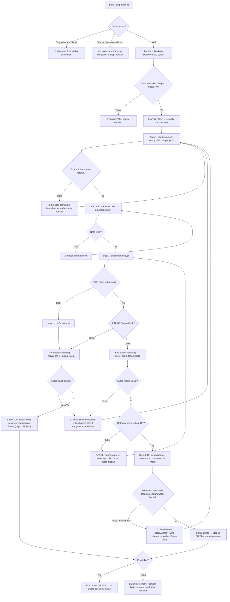
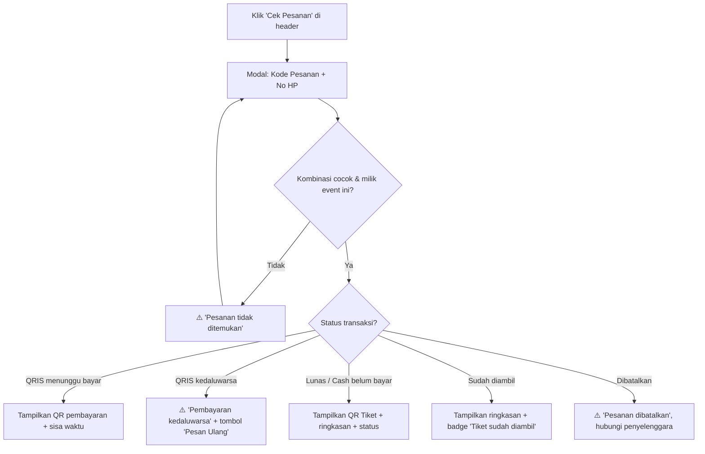
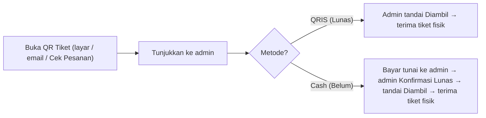
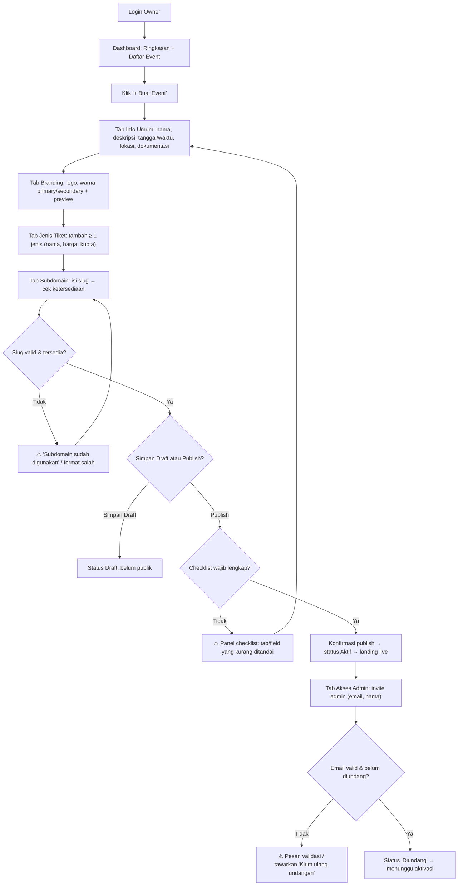
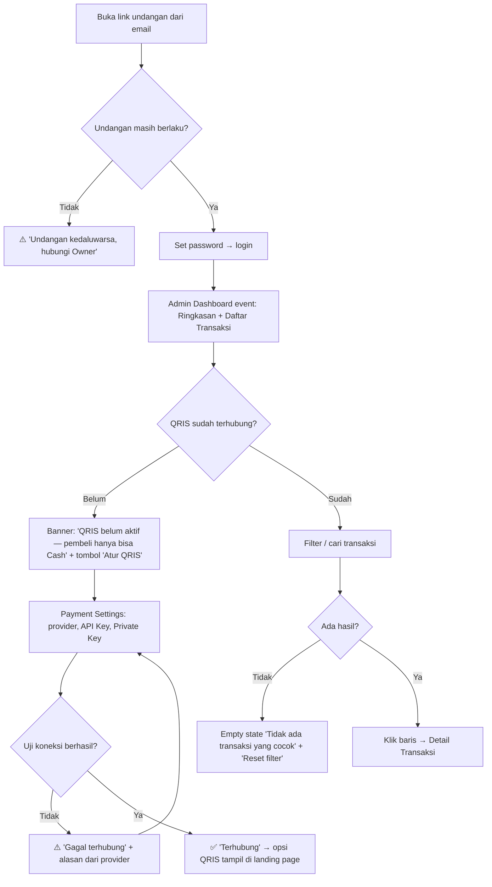
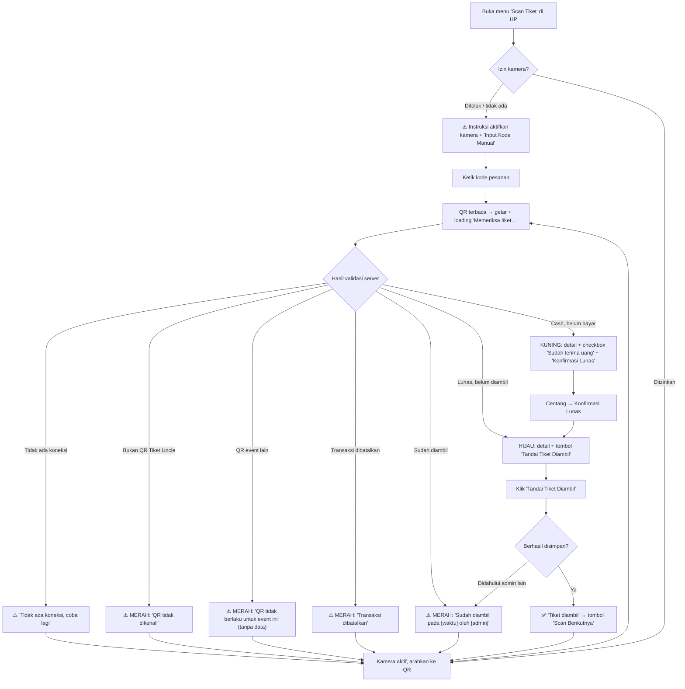

# UI/UX — Uncle: Platform Ticketing Event (White-Label)

> **Sumber kebenaran:** `uncle-overview.md` dan `PRD.md`. ID fitur (`LP-xx`,
> `OWN-xx`, `ADM-xx`, `SCN-xx`) dan aturan bisnis (`BR-xx`) merujuk ke `PRD.md`.
> Keputusan desain yang belum ditentukan di dokumen sumber ditandai
> **"Rekomendasi — bisa disesuaikan branding client"**. Hal yang bergantung pada
> asumsi PRD (mis. email opsional, batas waktu QRIS 15 menit, Cek Pesanan via
> kode pesanan + no HP) ditandai **(ikut asumsi PRD)**.
>
> **Contoh kasus:** event **Teater Bagol** (`teaterbagol.uncle.id`).
> **Status:** Draft v1 · **Tanggal:** 6 Oktober 2026 · **Scope:** MVP

**Tiga permukaan utama:**

| Permukaan | Pengguna | Perangkat utama | Branding |
|---|---|---|---|
| Landing Page `{slug}.uncle.id` | Customer | HP (mobile-first) | **Branding client** (logo + warna primary/secondary) |
| Owner Dashboard | Owner | Desktop/laptop (desktop-first) | Branding Uncle |
| Admin Dashboard + Scan Tiket | Admin/Client | Laptop & HP; Scan Tiket khusus HP | Branding Uncle + nama event |

---

## User Flow

> Diagram memakai Mermaid (dirender otomatis di GitHub/GitLab/VS Code).
> Kotak bertanda ⚠️ = jalur gagal/peringatan.

### 1. Customer — Beli Tiket (flow utama)



**Catatan flow:**
- Step 4 hanya ada untuk QRIS; Cash langsung ke Step 5 (sesuai overview).
- Label tombol Step 3 berubah sesuai metode: QRIS → **"Bayar Sekarang"**, Cash →
  **"Pesan Sekarang"**. *Rekomendasi — bisa disesuaikan branding client.*
  Alasan: kata "Bayar" untuk Cash membingungkan karena tidak ada pembayaran online.
- Jika customer menutup halaman saat Step 4, pesanan bisa dibuka lagi lewat
  **Cek Pesanan** selama belum kedaluwarsa.

### 2. Customer — Cek Pesanan (ikut asumsi PRD)



### 3. Customer — Hari-H di Venue



### 4. Owner — Buat & Publish Event



*Rekomendasi — bisa disesuaikan:* urutan tab boleh diisi bebas (tidak dipaksa
wizard), tetapi tombol **Publish** selalu menampilkan checklist kelengkapan.

### 5. Admin/Client — Aktivasi, Pantau Transaksi & Payment Settings



### 6. Admin/Client — Scan Tiket di Venue



---

## Wireframe / Mockup

> Lebar acuan: **Desktop 1280px**, **Mobile 360px** (HP Android entry-level).
> Bagian berwarna `[Primary]` memakai warna client di Landing Page dan warna
> Uncle di dashboard.

### 1. Landing Page

Struktur section **tetap**: Header → Hero → Share → Tab nav → Deskripsi →
Dokumentasi → Tiket → Lokasi → Footer. Alur checkout (Step 1–5) berada di
dalam section **Tiket**, sesuai overview.

#### 1.1 Desktop (≥ 1024px)

```
┌──────────────────────────────────────────────────────────────────────────┐
│ [Logo Client]                                          [ Cek Pesanan ]   │ Header (tinggi 64, sticky)
├──────────────────────────────────────────────────────────────────────────┤
│ ┌──────────────────────────────────────────────────────────────────────┐ │
│ │                    BANNER / COVER EVENT (16:9, max-h 480)            │ │ Hero
│ └──────────────────────────────────────────────────────────────────────┘ │
│  Teater Bagol — "Nama Lakon"                       ┌──────────────────┐  │
│  📅 Sabtu, 20 Des 2026 · 19:00 WIB                 │ Mulai Rp 75.000  │  │
│  📍 Gedung Kesenian, Jakarta  [Lihat peta]         │ [  Pilih Tiket  ]│  │ CTA card
│                                                    └──────────────────┘  │
├──────────────────────────────────────────────────────────────────────────┤
│  Ajak teman nonton:   [ WhatsApp ]  [ Salin Link ]                       │ Share
├──────────────────────────────────────────────────────────────────────────┤
│  Deskripsi   Dokumentasi   Tiket   Lokasi                                │ Tab nav (sticky di bawah header)
│  ━━━━━━━━━                                                               │ (underline = section aktif)
├──────────────────────────────────────────────┬───────────────────────────┤
│  ## Deskripsi                                │  RINGKASAN PESANAN        │
│  Tanggal: 20 Des 2026    Jam: 19:00 WIB      │  (sticky sidebar, muncul  │
│  Kategori: Teater        Tipe: Di lokasi     │   setelah ≥ 1 tiket       │
│                                              │   dipilih)                │
│  Paragraf deskripsi lengkap event ...        │                           │
│  ... (max-width teks 680px)                  │  2× Reguler   Rp 150.000  │
│                                              │  1× VIP       Rp 150.000  │
│  ▸ Kebijakan Pengembalian                    │  ───────────────────────  │
├──────────────────────────────────────────────┤  Total        Rp 300.000  │
│  ## Dokumentasi                              │  [ Lanjut Isi Data Diri ] │
│  ┌──────┐ ┌──────┐ ┌──────┐ ┌──────┐         │                           │
│  │foto 1│ │foto 2│ │foto 3│ │ ▶vid │  (grid  │                           │
│  └──────┘ └──────┘ └──────┘ └──────┘  4 kol) │                           │
├──────────────────────────────────────────────┤                           │
│  ## Tiket                                    │                           │
│  (lihat 1.3 Checkout per state)              │                           │
├──────────────────────────────────────────────┴───────────────────────────┤
│  ## Lokasi                                                               │
│  ┌───────────────────────────────────┐  Gedung Kesenian                  │
│  │        EMBED GOOGLE MAPS          │  Jl. Contoh No. 1, Jakarta        │
│  │           (16:9)                  │  [ Salin Alamat ] [ Petunjuk Arah]│
│  └───────────────────────────────────┘                                   │
├──────────────────────────────────────────────────────────────────────────┤
│  Kontak Penyelenggara  ·  Syarat & Kebijakan                             │ Footer
│  Metode Bayar: [QRIS] [Cash]                  Powered by Uncle (kecil)   │
└──────────────────────────────────────────────────────────────────────────┘
```

*Rekomendasi — bisa disesuaikan branding client:* sidebar "Ringkasan Pesanan"
yang sticky hanya di desktop; label kecil "Powered by Uncle" di footer
(opsional, bisa disembunyikan untuk white-label penuh).

#### 1.2 Mobile (360px)

```
┌────────────────────────────┐
│ [Logo]        [Cek Pesanan]│ Header 56px, sticky
├────────────────────────────┤
│                            │
│   BANNER / COVER (16:9)    │ Hero
│                            │
├────────────────────────────┤
│ Teater Bagol —             │
│ "Nama Lakon"               │
│ 📅 Sab, 20 Des 2026·19:00  │
│ 📍 Gedung Kesenian, Jkt    │
│    [Lihat peta]            │
├────────────────────────────┤
│ Ajak teman nonton:         │ Share
│ [ WhatsApp ] [ Salin Link ]│
├────────────────────────────┤
│ Deskripsi Dokumen… Tiket ▸ │ Tab nav: scroll horizontal, sticky
├────────────────────────────┤
│ ## Deskripsi               │
│ Tanggal  20 Des 2026       │
│ Jam      19:00 WIB         │
│ Kategori Teater            │
│ Tipe     Di lokasi         │
│ Paragraf deskripsi ...     │
│ [ Baca selengkapnya ▾ ]    │ (dipotong 6 baris)
│ ▸ Kebijakan Pengembalian   │
├────────────────────────────┤
│ ## Dokumentasi             │
│ ┌──────────┐┌──────────┐┌─ │ carousel geser horizontal
│ │  foto 1  ││  foto 2  ││  │ (tap → lightbox fullscreen)
│ └──────────┘└──────────┘└─ │
├────────────────────────────┤
│ ## Tiket  (lihat 1.3)      │
├────────────────────────────┤
│ ## Lokasi                  │
│ [   PETA (statis, tap →  ] │ Rekomendasi: gambar peta statis/
│ [   buka Google Maps)    ] │ lazy-load iframe untuk HP low-end
│ Gedung Kesenian            │
│ Jl. Contoh No. 1, Jakarta  │
│ [Salin Alamat][Petunjuk ↗] │
├────────────────────────────┤
│ Kontak Penyelenggara       │ Footer
│ Syarat & Kebijakan         │
│ Metode Bayar: [QRIS][Cash] │
├────────────────────────────┤
│ Mulai Rp 75.000            │ Sticky bottom bar (sebelum pilih tiket)
│ [      Pilih Tiket       ] │
└────────────────────────────┘

Sticky bottom bar setelah ≥ 1 tiket dipilih:
┌────────────────────────────┐
│ 3 tiket · Rp 300.000       │
│ [  Lanjut Isi Data Diri → ]│
└────────────────────────────┘
```

#### 1.3 Section Tiket / Checkout — per state

Di desktop, Step 2–5 tampil inline di section Tiket (kolom kiri) dengan
indikator step. Di mobile, Step 2–5 dibuka sebagai **halaman penuh (full-screen
sheet)** dengan tombol kembali, supaya fokus & tidak tertutup keyboard.
*Rekomendasi — bisa disesuaikan branding client.*

**Indikator step (semua breakpoint):**
```
 ① Tiket ── ② Data Diri ── ③ Pembayaran ── ④ Bayar ── ⑤ Tiket Siap
 (Step ④ disembunyikan bila metode Cash)
```

**Step 1 — Pilih Tiket (normal)**
```
┌──────────────────────────────────────────┐
│ Reguler                     Rp 75.000    │
│ Kuota tersisa: 120          [ − 2 + ]    │
├──────────────────────────────────────────┤
│ VIP                         Rp 150.000   │
│ Kuota tersisa: 40           [ − 1 + ]    │
├──────────────────────────────────────────┤
│ Subtotal (3 tiket)          Rp 300.000   │
│ [        Lanjut Isi Data Diri  →       ] │
└──────────────────────────────────────────┘
```

**Step 1 — sebagian habis / hampir habis / batas tercapai**
```
┌──────────────────────────────────────────┐
│ Reguler                     Rp 75.000    │
│ ⚠ Sisa 3 tiket!             [ − 3 + ]    │ ← "+" nonaktif, teks kuning
│ Maksimal sesuai kuota tersisa            │
├──────────────────────────────────────────┤
│ VIP                         Rp 150.000   │ ← kartu abu-abu (opacity)
│ [ HABIS ]                   [ −  0  + ]  │    stepper nonaktif
└──────────────────────────────────────────┘
 "Hampir habis" tampil bila sisa ≤ 10% kuota atau ≤ 10 tiket.
 (Rekomendasi — bisa disesuaikan)
```

**Step 1 — semua habis**
```
┌──────────────────────────────────────────┐
│            🎟  Tiket Habis                │
│  Semua tiket untuk event ini sudah       │
│  terjual. Hubungi penyelenggara untuk    │
│  info lebih lanjut.   [Kontak Penyelenggara]│
└──────────────────────────────────────────┘
 CTA Hero & sticky bar → [ Tiket Habis ] (nonaktif)
```

**Step 2 — Data Diri (dengan error)**
```
┌──────────────────────────────────────────┐
│ ← Kembali             Langkah 2 dari 4   │
│                                          │
│ Nama lengkap *                           │
│ [________________________]               │
│ ⓘ Wajib diisi                (merah)     │
│                                          │
│ No. HP (WhatsApp) *                      │
│ [ 12345__________________]               │ ← border merah
│ ⓘ Format no HP tidak valid. Contoh:      │
│   081234567890                           │
│                                          │
│ Email (opsional)                         │ (ikut asumsi PRD)
│ [________________________]               │
│ Untuk menerima QR Tiket lewat email      │
│                                          │
│ [            Lanjut  →                 ] │
└──────────────────────────────────────────┘
 Input No HP: type="tel", inputmode="numeric", autocomplete="tel".
```

**Step 3 — Metode Pembayaran**
```
┌──────────────────────────────────────────┐
│ Pilih metode pembayaran                  │
│ ┌──────────────────────────────────────┐ │
│ │ (●) QRIS                      [QRIS] │ │ ← terpilih: border Primary
│ │     Bayar pakai e-wallet / m-banking │ │
│ │     apa pun. Konfirmasi otomatis.    │ │
│ └──────────────────────────────────────┘ │
│ ┌──────────────────────────────────────┐ │
│ │ ( ) Cash                         💵  │ │
│ │     Bayar tunai saat ambil tiket di  │ │
│ │     lokasi.                          │ │
│ └──────────────────────────────────────┘ │
│ Ringkasan: 2× Reguler, 1× VIP            │
│ Total                       Rp 300.000   │
│ [          Bayar Sekarang  →           ] │ (Cash: "Pesan Sekarang")
└──────────────────────────────────────────┘
 Jika QRIS client belum terhubung: hanya kartu Cash, sudah terpilih.
```

**Step 4 — Pembayaran QRIS (menunggu)**
```
┌──────────────────────────────────────────┐
│ Scan untuk membayar                      │
│ Kode pesanan: UNC-7K3P9Q                 │
│         ┌──────────────────┐             │
│         │                  │             │
│         │   QR PEMBAYARAN  │  min 240px  │
│         │                  │             │
│         └──────────────────┘             │
│         Total  Rp 300.000                │
│   ⏱ Bayar dalam 14:32       (ikut asumsi │
│                              PRD 15 mnt) │
│   ◌ Menunggu pembayaran…   (auto-update) │
│                                          │
│ Cara bayar:                              │
│ 1. Buka e-wallet / m-banking             │
│ 2. Pilih Scan/QRIS                       │
│ 3. Scan QR di atas, cek nominal, bayar   │
│                                          │
│ [ Simpan QR ]  (unduh gambar QR — untuk  │
│               bayar dari HP yang sama)   │
│ Sudah bayar tapi belum berubah? Status   │
│ akan diperbarui otomatis. [Cek Status]   │
└──────────────────────────────────────────┘
 Countdown ≤ 2 menit → warna kuning; ≤ 30 detik → merah.
```

**Step 4 — Kedaluwarsa**
```
┌──────────────────────────────────────────┐
│         ⏱  Pembayaran Kedaluwarsa         │
│  Waktu pembayaran sudah habis dan tiket  │
│  yang kamu pilih dilepas kembali.        │
│  Jika saldo sudah terpotong, hubungi     │
│  penyelenggara dengan kode UNC-7K3P9Q.   │
│  [          Pesan Ulang          ]       │
└──────────────────────────────────────────┘
```

**Step 5 — Tiket Siap (QRIS Lunas)**
```
┌──────────────────────────────────────────┐
│ ✅ Pembayaran berhasil!                   │ banner hijau
│                                          │
│ QR TIKET                                 │
│         ┌──────────────────┐             │
│         │                  │             │
│         │     QR TIKET     │  min 240px, │
│         │                  │  quiet zone │
│         └──────────────────┘             │
│      Kode pesanan: UNC-7K3P9Q            │
│                                          │
│ Budi Santoso · 0812****7890              │
│ 2× Reguler, 1× VIP     [ ✔ Lunas ]       │
│ Teater Bagol · Sab, 20 Des 2026 · 19:00  │
│                                          │
│ Tunjukkan QR ini saat pengambilan tiket  │
│ di lokasi.                               │
│ ✅ Juga sudah dikirim ke email kamu       │ (hanya bila email terkirim)
│                                          │
│ [ Simpan QR Tiket ]  [ Tambah ke Kalender]│
└──────────────────────────────────────────┘
```

**Step 5 — Tiket Siap (Cash)**
```
┌──────────────────────────────────────────┐
│ ✅ Pesanan berhasil dibuat!               │
│         [      QR TIKET      ]           │
│      Kode pesanan: UNC-2M8R4T            │
│ 1× VIP              [ ⏳ Belum Bayar ]    │
│ ┌──────────────────────────────────────┐ │
│ │ 💵 Siapkan uang tunai Rp 150.000 dan │ │ info box kuning
│ │ bayar ke panitia saat ambil tiket.   │ │
│ └──────────────────────────────────────┘ │
│ (tanpa email) Simpan kode pesanan atau   │
│ screenshot halaman ini.                  │
└──────────────────────────────────────────┘
```

**Modal Cek Pesanan** (ikut asumsi PRD)
```
Desktop: modal 440px di tengah · Mobile: bottom sheet full-width
┌──────────────────────────────────┐
│ Cek Pesanan                  [✕] │
│ Kode Pesanan                     │
│ [ UNC-______ ]                   │
│ No. HP                           │
│ [ 08__________ ]                 │
│ [         Cari Pesanan         ] │
│ ⚠ Pesanan tidak ditemukan.       │ (state error)
└──────────────────────────────────┘
```

**Halaman Event Tidak Ditemukan / Draft**
```
┌────────────────────────────┐
│       (logo Uncle kecil)   │
│   Event tidak ditemukan    │
│ Periksa kembali alamat     │
│ yang kamu buka.            │
└────────────────────────────┘
```

### 2. Owner Dashboard

#### 2.1 Daftar Event — Desktop

```
┌────────────────────────────────────────────────────────────────────────────┐
│ UNCLE — Owner Dashboard                                 [ Profil Owner ▾ ] │
├───────────┬────────────────────────────────────────────────────────────────┤
│ ▣ Event   │ Ringkasan Semua Event                                          │
│ ○ Client  │ ┌─────────────┬─────────────┬─────────────┬──────────────────┐ │
│ ○ Report  │ │ Total Event │ Tiket       │ Event Aktif │ Revenue          │ │
│           │ │     12      │ Terjual     │      5      │ Rp 184.500.000   │ │
│           │ │             │   3.480     │             │ (bruto, info)    │ │
│           │ └─────────────┴─────────────┴─────────────┴──────────────────┘ │
│           │                                                                │
│           │ Daftar Event                                  [ + Buat Event ] │
│           │ [Cari event…]   Status: [Semua ▾]                              │
│           │ ┌────────────────┬─────────┬──────────┬───────────┬──────────┐ │
│           │ │ Event          │ Status  │ Terjual  │ Tanggal   │ Subdomain│ │
│           │ ├────────────────┼─────────┼──────────┼───────────┼──────────┤ │
│           │ │ Teater Bagol   │ ●Aktif  │ 230      │ 20 Des 26 │ teater…↗ │ │
│           │ │ Konser X       │ ○Draft  │ —        │ 10 Jan 27 │ —        │ │
│           │ │ Workshop Y     │ ◉Selesai│ 80       │ 02 Sep 26 │ worksh…↗ │ │
│           │ └────────────────┴─────────┴──────────┴───────────┴──────────┘ │
│           │ Klik baris → Edit Event                       ‹ 1 2 3 ›        │
└───────────┴────────────────────────────────────────────────────────────────┘
 Kolom "Terjual" tampil "terjual / total kuota" + progress bar tipis.
```

#### 2.2 Daftar Event — Mobile (Owner kadang cek dari HP)

```
┌────────────────────────────┐
│ ☰  UNCLE          [Profil] │
├────────────────────────────┤
│ ┌───────────┬────────────┐ │ kartu metrik 2×2
│ │ Event  12 │ Aktif    5 │ │
│ ├───────────┼────────────┤ │
│ │Terjual    │ Revenue    │ │
│ │ 3.480     │ Rp184,5 jt │ │
│ └───────────┴────────────┘ │
│ Daftar Event               │
│ [Cari…]        [Status ▾]  │
│ ┌────────────────────────┐ │
│ │ Teater Bagol   ●Aktif  │ │ list kartu, tap → edit
│ │ 20 Des 2026 · 230 terj.│ │
│ └────────────────────────┘ │
│ ┌────────────────────────┐ │
│ │ Konser X       ○Draft  │ │
│ └────────────────────────┘ │
│                     ( + )  │ FAB "Buat Event"
└────────────────────────────┘
```

#### 2.3 Form Edit Event — Desktop

```
┌────────────────────────────────────────────────────────────────────────────┐
│ ← Daftar Event   Edit Event: Teater Bagol   ●Aktif    [Lihat Landing ↗]    │
├────────────────────────────────────────────────────────────────────────────┤
│ Info Umum │ Branding │ Jenis Tiket │ Subdomain │ Akses Admin               │
│ ━━━━━━━━━                                                                  │
├──────────────────────────────────────────────┬─────────────────────────────┤
│ --- Info Umum ---                            │ CHECKLIST PUBLISH           │
│ Nama Event *      [ Teater Bagol — "…" ]     │ ✔ Nama event                │
│ Deskripsi *       [ rich text: B I list ]    │ ✔ Tanggal & waktu           │
│                   [                     ]    │ ✔ Lokasi                    │
│ Tanggal *  [20/12/2026]  Waktu * [19:00] WIB │ ✔ ≥ 1 jenis tiket           │
│ Lokasi *          [ Nama tempat ]            │ ✘ Subdomain belum diisi     │
│                   [ Alamat lengkap ]         │   → buka tab Subdomain      │
│                   [ Link Google Maps ]       │                             │
│ Kategori [Teater ▾]  Tipe [Di lokasi ▾]      │ (sticky di kanan)           │
│ Cover/Banner      [ Upload 16:9 ]            │                             │
│ Dokumentasi       [ + Upload Foto / Video ]  │                             │
│   ┌────┐┌────┐┌────┐  drag untuk urutkan     │                             │
│   │ 1 ✕││ 2 ✕││ ▶✕ │                         │                             │
│   └────┘└────┘└────┘                         │                             │
│ Konten Pendukung (opsional)                  │                             │
│   Kontak Penyelenggara [________________]    │                             │
│   Syarat & Kebijakan   [________________]    │                             │
│   Kebijakan Pengembalian [______________]    │                             │
├──────────────────────────────────────────────┴─────────────────────────────┤
│ Perubahan belum disimpan •          [ Simpan Draft ]  [ Simpan & Publish ] │ sticky footer
└────────────────────────────────────────────────────────────────────────────┘
```

*Rekomendasi — bisa disesuaikan:* kategori, tipe, kontak, syarat, dan kebijakan
pengembalian ditaruh di tab Info Umum sebagai "Konten Pendukung" (menjawab
PRD Q15 tanpa menambah tab baru). Cover/Banner dipisah dari dokumentasi.

**Tab Branding (dengan live preview)**
```
┌──────────────────────────────────────────────┬─────────────────────────────┐
│ Logo        [ Upload ] PNG/SVG, latar        │  PREVIEW (mobile 360)       │
│             transparan disarankan            │  ┌───────────────────────┐  │
│ Warna Primary   [■ #8B1E3F]                  │  │[Logo]   [Cek Pesanan] │  │
│ Warna Secondary [■ #F2C14E]                  │  │  BANNER               │  │
│                                              │  │  Teater Bagol         │  │
│ ⚠ Kontras teks putih di atas Primary 3.1:1   │  │ [  Pilih Tiket  ]     │  │
│   (min 4.5:1). Tombol akan memakai teks      │  └───────────────────────┘  │
│   gelap otomatis.     [Pakai saran: #6F1832] │                             │
└──────────────────────────────────────────────┴─────────────────────────────┘
```

**Tab Jenis Tiket**
```
┌────────────────────────────────────────────────────────────────────────┐
│ [+ Tambah Jenis Tiket]                                                 │
│ ┌────────────┬─────────────┬────────┬──────────┬──────────┬──────────┐ │
│ │ Nama       │ Harga       │ Kuota  │ Terjual  │ Status   │          │ │
│ ├────────────┼─────────────┼────────┼──────────┼──────────┼──────────┤ │
│ │ Reguler    │ Rp 75.000   │ 150    │ 120      │ Aktif    │ ✎  ⋯     │ │
│ │ VIP        │ Rp 150.000  │ 50     │ 10       │ Aktif    │ ✎  ⋯     │ │
│ └────────────┴─────────────┴────────┴──────────┴──────────┴──────────┘ │
│ Edit inline → error contoh:                                            │
│ Kuota [ 100 ]  ⓘ Tidak boleh lebih kecil dari tiket terjual (120)      │
│ "Hapus" diganti "Nonaktifkan" jika jenis tiket sudah punya transaksi.  │
└────────────────────────────────────────────────────────────────────────┘
```

**Tab Subdomain**
```
│ Slug  [ teaterbagol      ] .uncle.id                                   │
│       ✔ Tersedia — teaterbagol.uncle.id         (hijau, cek debounce)  │
│       ✘ Subdomain sudah digunakan                (merah)               │
│       ✘ Hanya huruf kecil, angka, dan "-" (3–30 karakter)              │
│ 🔒 Slug tidak bisa diubah karena event sudah punya transaksi.          │ (state terkunci)
```

**Tab Akses Admin**
```
│ [+ Invite Admin]   Email [____________]  Nama [__________]  [Kirim]    │
│ ┌──────────────────────────┬────────────┬──────────────┬────────────┐  │
│ │ admin@teaterbagol.com    │ Rina       │ ● Aktif      │ ⋯ Cabut    │  │
│ │ panitia2@teaterbagol.com │ Dodi       │ ◌ Diundang   │ Kirim ulang│  │
│ │ lama@teaterbagol.com     │ —          │ ⚠ Kedaluwarsa│ Kirim ulang│  │
│ └──────────────────────────┴────────────┴──────────────┴────────────┘  │
```

**Dialog konfirmasi Publish**
```
┌──────────────────────────────────────────┐
│ Publish event?                           │
│ Landing page akan langsung live di       │
│ teaterbagol.uncle.id dan bisa diakses    │
│ publik.                                  │
│               [ Batal ]  [ Publish ]     │
└──────────────────────────────────────────┘
```

#### 2.4 Form Edit Event — Mobile

```
┌────────────────────────────┐
│ ←  Edit Event      [⋯]     │
├────────────────────────────┤
│ Info Umum ▾                │ tab → dropdown/segmented scroll
├────────────────────────────┤
│ Nama Event *               │
│ [________________________] │ 1 kolom, field full-width
│ Deskripsi *                │
│ [________________________] │
│ Tanggal *                  │
│ [ 20/12/2026 ]             │
│ Waktu *                    │
│ [ 19:00 ]                  │
│ ...                        │
│ ▸ Checklist publish (1)    │ collapsible
├────────────────────────────┤
│ [Simpan Draft] [Publish]   │ sticky bottom
└────────────────────────────┘
```

### 3. Admin Dashboard

#### 3.1 Daftar Transaksi — Desktop

```
┌────────────────────────────────────────────────────────────────────────────┐
│ UNCLE — Admin Dashboard · Teater Bagol                       [ Profil ▾ ]  │
├────────────┬───────────────────────────────────────────────────────────────┤
│ ▣ Transaksi│ ⚠ QRIS belum aktif — pembeli hanya bisa bayar Cash. [Atur QRIS]│ (banner, hanya bila belum terhubung)
│ ○ Scan     │ Ringkasan                                                     │
│   Tiket    │ ┌──────────┬──────────┬──────────┬──────────┐                 │
│ ○ Payment  │ │ Terjual  │ Lunas    │ Belum    │ Diambil  │                 │
│   Settings │ │   230    │   210    │   20     │   180    │                 │
│            │ └──────────┴──────────┴──────────┴──────────┘                 │
│            │ (klik kartu = filter cepat, mis. klik "Belum")                │
│            │                                                               │
│            │ Daftar Transaksi                                              │
│            │ [🔍 Cari nama / no HP / kode…]  Bayar:[Semua▾] Ambil:[Semua▾] │
│            │ Metode:[Semua▾]                     Menampilkan 230 transaksi │
│            │ ┌─────────┬───────────┬────────────┬──────┬────────┬────────┐ │
│            │ │ Nama    │ No HP     │ Tiket      │Metode│ Bayar  │ Ambil  │ │
│            │ ├─────────┼───────────┼────────────┼──────┼────────┼────────┤ │
│            │ │ Budi S. │ 0812…7890 │ 2 Reg      │ QRIS │✔Lunas  │○Belum  │ │
│            │ │ Siti R. │ 0813…1122 │ 1 VIP      │ Cash │⏳Belum │○Belum  │ │
│            │ │ Andi P. │ 0857…3344 │ 2 Reg,1 VIP│ QRIS │✔Lunas  │✔Diambil│ │
│            │ │ Dewi K. │ 0878…5566 │ 1 Reg      │ QRIS │◷Menunggu│○Belum │ │
│            │ └─────────┴───────────┴────────────┴──────┴────────┴────────┘ │
│            │                                     ‹ 1 2 … 12 ›  25/hal ▾   │
└────────────┴───────────────────────────────────────────────────────────────┘
 Klik baris → drawer Detail Transaksi dari kanan (lebar 420px).
```

*Rekomendasi:* transaksi QRIS berstatus Menunggu/Kedaluwarsa disembunyikan
secara default (filter "Tampilkan pesanan belum selesai"), supaya daftar tidak
penuh oleh checkout yang ditinggal.

**Drawer Detail Transaksi**
```
┌──────────────────────────────────┐
│ Detail Transaksi             [✕] │
│ UNC-7K3P9Q                       │
│ [✔ Lunas] [○ Belum Diambil]      │
│ ───────────────────────────────  │
│ Nama     Budi Santoso            │
│ No HP    081234567890  [📋][WA]  │
│ Email    budi@mail.com           │
│ ───────────────────────────────  │
│ 2× Reguler        Rp 150.000     │
│ Total             Rp 150.000     │
│ Metode            QRIS           │
│ ───────────────────────────────  │
│ Riwayat                          │
│ • 12 Nov 10:02 Pesanan dibuat    │
│ • 12 Nov 10:04 Lunas (webhook)   │
│ • —  Belum diambil               │
└──────────────────────────────────┘
```

#### 3.2 Daftar Transaksi — Mobile (operasional di venue)

```
┌────────────────────────────┐
│ ☰ Teater Bagol     [Profil]│
├────────────────────────────┤
│ ┌─────┬─────┬─────┬──────┐ │ kartu ringkasan scroll horizontal
│ │Terj.│Lunas│Belum│Diamb.│ │ atau grid 2×2
│ │ 230 │ 210 │ 20  │ 180  │ │
│ └─────┴─────┴─────┴──────┘ │
│ [🔍 Cari nama/HP/kode    ] │
│ [Belum bayar][Belum ambil] │ chip filter cepat (toggle)
│ [Filter ▾]                 │ → bottom sheet filter lengkap
├────────────────────────────┤
│ ┌────────────────────────┐ │
│ │ Budi S.        QRIS    │ │ kartu transaksi
│ │ 0812…7890 · 2 Reguler  │ │
│ │ [✔Lunas] [○Belum ambil]│ │
│ └────────────────────────┘ │
│ ┌────────────────────────┐ │
│ │ Siti R.        Cash    │ │
│ │ 0813…1122 · 1 VIP      │ │
│ │ [⏳Belum] [○Belum ambil]│ │
│ └────────────────────────┘ │
│        (infinite scroll)   │
├────────────────────────────┤
│ [Transaksi] [📷 Scan] [⚙]  │ bottom navigation; Scan di tengah, menonjol
└────────────────────────────┘
```

#### 3.3 Payment Settings — per state

```
Desktop: form 560px di tengah · Mobile: full-width, 1 kolom

(a) Belum diatur
┌──────────────────────────────────────────┐
│ Konfigurasi QRIS                         │
│ Status Koneksi   ○ Belum diatur          │
│ ⓘ Pembayaran QRIS masuk langsung ke      │
│   rekening akun QRIS kamu. Uncle tidak   │
│   menyimpan dana.                        │
│ Provider         [ Tripay ▾ ]            │
│ API Key          [______________] 👁      │
│ Private Key      [______________] 👁      │
│ ⓘ Cara mendapatkan API Key ↗             │
│ [         Simpan & Uji Koneksi         ] │
└──────────────────────────────────────────┘

(b) Sedang menguji
│ [ ◌ Menguji koneksi…            ] (disabled)│

(c) Terhubung
│ Status Koneksi   ✅ Terhubung             │
│                  Diuji 12 Nov 2026 10:00  │
│ API Key          [ ●●●●●●●●●●a3f9 ]       │ (masked, 4 char terakhir)
│ Private Key      [ ●●●●●●●●●●●●●● ]       │
│ [ Ganti Kredensial ]  [ Uji Ulang ]       │

(d) Gagal
│ Status Koneksi   ✘ Gagal terhubung        │
│ ┌──────────────────────────────────────┐ │
│ │ Provider menolak kredensial:         │ │ error box merah
│ │ "Invalid API Key". Periksa kembali.  │ │
│ └──────────────────────────────────────┘ │
│ ⓘ Opsi QRIS tidak tampil di landing page │
│   sampai koneksi berhasil.               │
```

### 4. Halaman Scan Tiket (Mobile-only)

Layout tetap: **header ringkas → area kamera (±55% tinggi layar) → panel hasil
(bottom sheet)**. Panel hasil memakai warna latar sesuai hasil agar bisa dibaca
sekilas di venue yang ramai/gelap.

**(a) Siap scan**
```
┌─────────────────────────┐
│ ←  Scan Tiket    [🔦]   │ 🔦 = toggle senter (bila didukung)
│ Teater Bagol · 180/230  │ progres diambil
├─────────────────────────┤
│ ┌─────────────────────┐ │
│ │   ┌───────────┐     │ │
│ │   │  ┌─────┐  │     │ │ bingkai bidik
│ │   │  │     │  │     │ │
│ │   │  └─────┘  │     │ │
│ │   └───────────┘     │ │
│ │ Arahkan ke QR tiket │ │
│ └─────────────────────┘ │
├─────────────────────────┤
│ [ ⌨ Input Kode Manual ] │
└─────────────────────────┘
```

**(b) Memproses**
```
├─────────────────────────┤
│  ◌ Memeriksa tiket…     │ (kamera dijeda, skeleton panel)
│  ▒▒▒▒▒▒▒▒▒▒▒▒           │
│  ▒▒▒▒▒▒▒▒               │
└─────────────────────────┘
```

**(c) QRIS Lunas — siap diambil (panel HIJAU)**
```
├─────────────────────────┤
│ ✅ SIAP DIAMBIL          │ bg hijau muda, ikon besar
│ Nama   : Budi S.        │
│ Tiket  : 2× Reguler     │
│ Metode : QRIS           │
│ Bayar  : ✔ Lunas        │
│ Kode   : UNC-7K3P9Q     │
│ ┌─────────────────────┐ │
│ │ Tandai Tiket Diambil│ │ tombol primer, tinggi 56px
│ └─────────────────────┘ │
│ [ Batal / Scan Lain ]   │
└─────────────────────────┘
```

**(d) Cash belum bayar (panel KUNING)**
```
├─────────────────────────┤
│ 💵 BELUM BAYAR (CASH)    │ bg kuning muda
│ Nama   : Siti R.        │
│ Tiket  : 1× VIP         │
│ Metode : Cash           │
│ Bayar  : ⏳ Belum        │
│ ┌─────────────────────┐ │
│ │ TAGIH  Rp 150.000   │ │ nominal besar (24px bold)
│ └─────────────────────┘ │
│ [☐] Sudah terima uang   │ target sentuh 48px
│ [ Konfirmasi Lunas ]    │ nonaktif sampai dicentang
│ [ Tandai Diambil ]      │ nonaktif (abu) + label
│  "Aktif setelah lunas"  │
└─────────────────────────┘
```

**(e) Cash setelah Konfirmasi Lunas**
```
│ ✅ LUNAS — siap diambil  │ panel berubah HIJAU
│ Bayar  : ✔ Lunas (Cash, │
│          oleh Rina 18:42)│
│ [ Tandai Tiket Diambil ]│ aktif
```

**(f) Sukses diambil**
```
┌─────────────────────────┐
│                         │
│        ✔ (besar)        │ layar hijau penuh ±1,5 detik
│   Tiket diambil!        │ + getar pendek
│   Budi S. · 2× Reguler  │
│                         │
│ [  Scan Berikutnya  ]   │ auto kembali ke (a) setelah 3 detik
└─────────────────────────┘
```

**(g) Gagal — sudah diambil / tidak valid / event lain / dibatalkan (panel MERAH)**
```
├─────────────────────────┤
│ ⛔ SUDAH DIAMBIL          │ bg merah muda, getar panjang
│ Diambil 20 Des 18:31    │
│ oleh Dodi               │
│ Nama   : Budi S.        │
│ Tiket  : 2× Reguler     │
│ [   Scan Berikutnya   ] │
└─────────────────────────┘

│ ⛔ QR TIDAK BERLAKU UNTUK │  (tanpa data transaksi)
│    EVENT INI             │
│ ⛔ QR TIDAK DIKENALI      │
│ ⛔ TRANSAKSI DIBATALKAN   │
```

**(h) Izin kamera ditolak**
```
┌─────────────────────────┐
│ ←  Scan Tiket           │
├─────────────────────────┤
│     📷✕                  │
│ Kamera tidak bisa       │
│ diakses.                │
│ Izinkan kamera di       │
│ pengaturan browser,     │
│ lalu muat ulang.        │
│ [ Coba Lagi ]           │
│ [ ⌨ Input Kode Manual ] │
└─────────────────────────┘
```

**(i) Input kode manual (bottom sheet)**
```
│ Kode Pesanan                │
│ [ UNC-______ ]  (huruf besar│
│  otomatis, keyboard teks)   │
│ [        Cari        ]      │
```

**(j) Offline**
```
│ ⚠ Tidak ada koneksi internet │ banner merah sticky di atas kamera
│   Scan dijeda. Coba lagi.    │
```

**Desktop:** halaman Scan Tiket tidak dioptimalkan untuk desktop. Bila dibuka
di layar ≥ 1024px tanpa kamera, tampilkan: *"Buka halaman ini dari HP untuk
memindai tiket"* + QR berisi link halaman scan + opsi **Input Kode Manual**.

---

## Design System

### 1. Prinsip Visual

| Prinsip | Penerapan |
|---|---|
| **Minimalis** | Satu aksi utama per layar/step. Tidak ada navigasi marketplace di landing page. Dekorasi minim; konten event (foto, deskripsi) yang menonjol. |
| **Trustworthy** | Nominal & status pembayaran selalu terlihat jelas. Warna status konsisten di semua permukaan & **tidak bisa di-override client**. Copy transparan ("Uang langsung masuk ke rekening penyelenggara", "Konfirmasi otomatis"). Logo QRIS resmi di opsi pembayaran. |
| **Mudah dibaca di HP low-end & venue** | Font body min 16px, kontras min WCAG AA (4.5:1 teks, 3:1 elemen UI). Status = **warna + ikon + teks** (tidak hanya warna). Target sentuh min 48×48px di Scan Tiket. Animasi minimal, tanpa efek blur/bayangan berat. Gambar lazy-load & dikompres. |
| **White-label** | Landing page mengikuti **logo & warna client**; Uncle tampil seminimal mungkin. Dashboard memakai identitas Uncle. |

### 2. Palet Warna

#### 2.1 Token warna brand (dua lapis)

| Token | Landing Page | Dashboard (Uncle) | Kegunaan |
|---|---|---|---|
| `--color-primary` | **Warna Primary client** | `#2563EB` (biru) | Tombol utama, link, tab aktif, stepper, border opsi terpilih |
| `--color-primary-hover` | Primary client −10% lightness (otomatis) | `#1D4ED8` | Hover/pressed |
| `--color-primary-subtle` | Primary client 10% opacity di atas putih | `#EFF6FF` | Latar opsi terpilih, highlight |
| `--color-on-primary` | Putih **atau** `#111827` — dipilih otomatis berdasar kontras | `#FFFFFF` | Teks di atas tombol primary |
| `--color-secondary` | **Warna Secondary client** | `#0F172A` (slate gelap) | Aksen: badge kategori, garis dekoratif, header section. Tidak dipakai untuk teks panjang. |

*Rekomendasi — bisa disesuaikan branding client:* warna default Uncle di atas.
Saat Owner memilih warna client, sistem menghitung kontras: jika teks putih di
atas Primary < 4.5:1, `--color-on-primary` otomatis jadi gelap dan Owner diberi
peringatan + saran warna yang lebih gelap (lihat wireframe tab Branding).

#### 2.2 Netral (tetap, semua permukaan)

| Token | Hex | Kegunaan |
|---|---|---|
| `--neutral-0` | `#FFFFFF` | Latar kartu, latar halaman landing |
| `--neutral-50` | `#F8FAFC` | Latar halaman dashboard |
| `--neutral-100` | `#F1F5F9` | Latar input disabled, zebra tabel |
| `--neutral-200` | `#E2E8F0` | Border, divider |
| `--neutral-400` | `#94A3B8` | Placeholder, ikon nonaktif |
| `--neutral-600` | `#475569` | Teks sekunder (kontras 7.5:1 di putih) |
| `--neutral-900` | `#0F172A` | Teks utama |

#### 2.3 Warna Status (tetap, tidak bisa diubah client)

| Status | Teks/ikon | Latar (subtle) | Border | Ikon | Dipakai untuk |
|---|---|---|---|---|---|
| **Sukses** | `#15803D` | `#DCFCE7` | `#86EFAC` | ✔ | Lunas, Diambil, Terhubung, panel scan "Siap Diambil" |
| **Gagal / Bahaya** | `#B91C1C` | `#FEE2E2` | `#FCA5A5` | ⛔ / ✘ | Kedaluwarsa (di sisi customer), QR tidak valid, sudah diambil (scan), gagal terhubung, error field |
| **Pending / Peringatan** | `#B45309` | `#FEF3C7` | `#FCD34D` | ⏳ | Belum bayar (Cash), Menunggu pembayaran (QRIS), kuota hampir habis, banner QRIS belum aktif |
| **Info** | `#1D4ED8` | `#DBEAFE` | `#93C5FD` | ⓘ | Pesan informatif, Diundang |
| **Netral** | `#475569` | `#F1F5F9` | `#CBD5E1` | ○ | Belum diambil, Draft, Habis, Dibatalkan, Kedaluwarsa (di tabel admin) |

**Pemetaan status → badge** (dipakai `TransactionStatusBadge`):

| Konteks | Status | Varian |
|---|---|---|
| Bayar | Lunas | Sukses |
| Bayar | Belum (Cash) | Pending |
| Bayar | Menunggu Pembayaran (QRIS) | Pending |
| Bayar | Kedaluwarsa | Netral |
| Bayar | Dibatalkan / Perlu Refund | Gagal |
| Ambil | Diambil | Sukses |
| Ambil | Belum | Netral |
| Event | Aktif / Draft / Selesai | Sukses / Netral / Info |
| Kuota | Hampir habis / Habis | Pending / Netral |

### 3. Tipografi

**Font:** `Inter` (self-hosted, subset Latin, `font-display: swap`) dengan
fallback system stack:
`Inter, -apple-system, "Segoe UI", Roboto, "Noto Sans", Arial, sans-serif`.
Angka nominal & kode pesanan memakai `font-variant-numeric: tabular-nums`; kode
pesanan memakai monospace (`"JetBrains Mono", ui-monospace, monospace`).
*Rekomendasi — bisa disesuaikan branding client:* client tidak bisa mengganti
font di MVP (menjaga performa HP low-end); kustomisasi cukup lewat logo & warna.

| Token | Ukuran / line-height | Weight | Kegunaan |
|---|---|---|---|
| `display` | 36 / 44 (mobile 28 / 36) | 700 | Nama event di Hero |
| `h1` | 30 / 38 (mobile 24 / 32) | 700 | Judul halaman dashboard |
| `h2` | 24 / 32 (mobile 20 / 28) | 600 | Judul section (Deskripsi, Tiket…) |
| `h3` | 20 / 28 (mobile 18 / 26) | 600 | Judul kartu, nama jenis tiket |
| `body-lg` | 18 / 28 | 400 | Nominal total, deskripsi event di desktop |
| `body` | 16 / 24 | 400 | Teks umum, input (min 16px agar iOS tidak auto-zoom) |
| `body-sm` | 14 / 20 | 400 | Teks sekunder, isi tabel dashboard, helper text |
| `caption` | 12 / 16 | 500 | Label badge, timestamp. **Tidak dipakai** untuk info penting di HP. |
| `scan-status` | 24 / 32 | 700 | Judul panel hasil scan (SIAP DIAMBIL, BELUM BAYAR…) |
| `metric` | 32 / 40 (mobile 24 / 32) | 700 | Angka kartu ringkasan |

### 4. Spacing Scale (basis 4px)

| Token | px | Contoh pemakaian |
|---|---|---|
| `space-1` | 4 | Jarak ikon–teks di badge |
| `space-2` | 8 | Jarak label–input, gap chip |
| `space-3` | 12 | Padding badge, gap antar baris info |
| `space-4` | 16 | **Gutter mobile**, padding kartu mobile |
| `space-5` | 20 | Padding input horizontal |
| `space-6` | 24 | Padding kartu desktop, gap antar field |
| `space-8` | 32 | Jarak antar grup form, gutter desktop |
| `space-10` | 40 | Jarak antar section landing (mobile) |
| `space-12` | 48 | Tinggi tombol standar |
| `space-16` | 64 | Jarak antar section landing (desktop), tinggi header desktop |

### 5. Border Radius

| Token | px | Kegunaan |
|---|---|---|
| `radius-sm` | 4 | Badge, checkbox, chip kecil |
| `radius-md` | 8 | Tombol, input, stepper |
| `radius-lg` | 12 | Kartu (TicketTypeCard, kartu transaksi, kartu metrik), modal |
| `radius-xl` | 16 | Bottom sheet (sudut atas), kontainer QR |
| `radius-full` | 9999 | Avatar, pill filter, FAB |

*Rekomendasi — bisa disesuaikan branding client:* radius tetap di MVP; ke depan
bisa ditambah pilihan "tegas (4)" / "lembut (12)" per client.

### 6. Elevasi, Ikon & Gerak

- **Elevasi:** hanya 2 level — `shadow-sm` (`0 1px 2px rgba(15,23,42,.06)`) untuk
  kartu, `shadow-lg` (`0 8px 24px rgba(15,23,42,.12)`) untuk modal/drawer/sticky
  bar. Hindari blur besar (berat di HP low-end).
- **Ikon:** satu set outline 24px (mis. Lucide), stroke 2px. Ikon status selalu
  disertai teks.
- **Gerak:** durasi 150–200ms, `ease-out`. Hormati `prefers-reduced-motion`.
  Satu-satunya animasi "besar": layar sukses scan (≤ 1,5 detik).
- **Umpan balik non-visual di Scan Tiket:** getar (`navigator.vibrate`) pendek
  = sukses, panjang = gagal; bunyi beep opsional (toggle).

### 7. Breakpoints

| Token | Min-width | Target |
|---|---|---|
| `base` | 0 (acuan 360) | HP kecil |
| `sm` | 480 | HP besar |
| `md` | 768 | Tablet / HP landscape |
| `lg` | 1024 | Laptop |
| `xl` | 1280 | Desktop |

---

## Components

### 1. Komponen Landing Page

| Komponen | Fungsi | Varian / Props utama | Dipakai di |
|---|---|---|---|
| `EventHeader` | Header minimal: logo client + tombol "Cek Pesanan". Sticky. | `logoUrl` | Landing (semua section) |
| `EventHero` | Banner/cover, nama event, tanggal & jam, lokasi + "Lihat peta", CTA "Pilih Tiket". | `ctaState: available \| soldOut \| closed`, `startingPrice` | Landing — Hero |
| `ShareBar` | Tombol WhatsApp (deep link `wa.me/?text=`) & Salin Link (+ toast). | `url`, `message` | Landing — Share |
| `SectionTabNav` | Tab sticky; tab aktif mengikuti scroll (scroll-spy); klik → smooth scroll. | `sections[]` | Landing — Tab nav |
| `EventInfoGrid` | Grid label-nilai: tanggal, jam, kategori, tipe. | `items[]` | Landing — Deskripsi |
| `ExpandableText` | Teks panjang dengan "Baca selengkapnya". | `maxLines` | Landing — Deskripsi |
| `Accordion` | Expand/collapse. | `title`, `defaultOpen` | Kebijakan Pengembalian, FAQ |
| `MediaGallery` | Grid (desktop) / carousel (mobile) foto & video + lightbox. | `items[]` (foto/video) | Landing — Dokumentasi; preview Owner |
| `TicketTypeCard` | Satu jenis tiket: nama, harga, kuota tersisa, `QuantityStepper`. | `state: available \| lowStock \| soldOut \| inactive` | Landing — Tiket (Step 1) |
| `QuantityStepper` | Tombol − / angka / +; dibatasi min 0, max = min(kuota tersisa, batas per transaksi). | `value`, `min`, `max`, `disabled` | `TicketTypeCard` |
| `OrderSummary` | Daftar item terpilih, subtotal/total. | `variant: sidebar \| inline \| compact` | Landing desktop sidebar, Step 3, Step 5, Cek Pesanan |
| `StickyCheckoutBar` | Bar bawah mobile: harga mulai / jumlah tiket + total + CTA sesuai step. | `label`, `total`, `ctaLabel`, `disabled` | Landing mobile |
| `CheckoutStepper` | Indikator langkah 1–5 (Step 4 disembunyikan bila Cash). | `currentStep`, `method` | Landing — Tiket (Step 1–5) |
| `CustomerForm` | Field Nama, No HP, Email opsional + validasi inline. | `errors{}` | Landing — Step 2 |
| `PaymentMethodSelector` | Kartu radio QRIS / Cash dengan deskripsi singkat; QRIS disembunyikan bila tidak terhubung. | `methods[]`, `selected` | Landing — Step 3 |
| `QRCodeDisplay` | Render QR dengan quiet zone, ukuran min 240px, tombol "Simpan QR". **Dua varian dengan label jelas** agar tidak tertukar. | `variant: payment \| ticket`, `value`, `caption` | Step 4 (payment), Step 5 & Cek Pesanan (ticket), email |
| `PaymentCountdown` | Hitung mundur batas bayar; berubah warna mendekati habis. | `expiresAt` | Step 4 |
| `PaymentStatusPoller` | (Non-visual) polling/SSE status transaksi tiap ±3 detik; memicu transisi ke Step 5 / kedaluwarsa. | `transactionId` | Step 4, Cek Pesanan |
| `OrderCodeChip` | Kode pesanan monospace + tombol salin. | `code` | Step 4, Step 5, Detail Transaksi, Scanner |
| `CheckOrderModal` | Form kode pesanan + no HP → tampilkan pesanan. | — | Landing header |
| `LocationMap` | Embed/gambar statis peta + alamat + Salin Alamat + Petunjuk Arah. | `lat/lng` atau `mapsUrl`, `address` | Landing — Lokasi |
| `EventFooter` | Kontak, Syarat & Kebijakan, ikon metode bayar. | `methods[]` | Landing — Footer |

### 2. Komponen Dashboard (Owner & Admin)

| Komponen | Fungsi | Varian / Props utama | Dipakai di |
|---|---|---|---|
| `AppShell` | Kerangka: sidebar (desktop) / drawer + bottom nav (mobile), topbar dengan profil. | `role: owner \| admin`, `eventName` | Semua halaman dashboard |
| `BottomNav` | Navigasi bawah mobile dengan tombol Scan menonjol. | `items[]` | Admin mobile |
| `MetricCard` | Angka ringkasan + label; bisa diklik sebagai filter cepat. | `value`, `label`, `onClick?` | Owner Ringkasan, Admin Ringkasan |
| `DataTable` | Tabel dengan sort, paginasi, klik baris; berubah menjadi list kartu di mobile. | `columns[]`, `rows[]`, `mobileCard` | Daftar Event, Daftar Transaksi, Jenis Tiket, Akses Admin |
| `TransactionCard` | Versi kartu satu transaksi (mobile). | `transaction` | Admin mobile |
| `EventCard` | Versi kartu satu event (mobile). | `event` | Owner mobile |
| `SearchInput` | Input cari dengan debounce 300ms & tombol clear. | `placeholder` | Daftar Event, Daftar Transaksi |
| `FilterBar` / `FilterSheet` | Dropdown filter (desktop) / bottom sheet + chip cepat (mobile). | `filters[]` | Daftar Event, Daftar Transaksi |
| `TransactionStatusBadge` | Badge status bayar/ambil/event sesuai tabel pemetaan di Design System. | `type: payment \| pickup \| event`, `status` | Tabel/kartu transaksi, Detail, Scanner, Step 5, Daftar Event |
| `TransactionDetailDrawer` | Detail transaksi + riwayat status (siapa & kapan). | `transactionId` | Admin Daftar Transaksi |
| `Tabs` | Tab horizontal (desktop) / dropdown atau scroll (mobile). | `items[]` | Form Edit Event |
| `FormField` | Label + input + helper/error; konsisten di semua form. | `label`, `required`, `error`, `helper` | Semua form |
| `RichTextEditor` | Editor deskripsi sederhana (bold, italic, list, link). | — | Edit Event — Info Umum |
| `DateTimePicker` | Pilih tanggal & jam (WIB). | — | Edit Event — Info Umum |
| `MediaUploader` | Upload drag & drop, progress, preview, urutkan, hapus, validasi format/ukuran. | `accept`, `maxSize`, `multiple` | Dokumentasi, Cover, Logo |
| `ColorPicker` | Pilih warna + hex + **cek kontras otomatis** + saran warna. | `value`, `contrastAgainst` | Edit Event — Branding |
| `BrandPreview` | Preview mini landing page (mobile) dengan logo & warna terpilih. | `logo`, `primary`, `secondary` | Edit Event — Branding |
| `TicketTypeEditor` | Baris editable nama/harga/kuota + validasi kuota ≥ terjual. | `ticketType`, `soldCount` | Edit Event — Jenis Tiket |
| `SlugInput` | Input slug + suffix `.uncle.id` + cek ketersediaan live; bisa terkunci. | `locked` | Edit Event — Subdomain |
| `InviteAdminForm` + `AdminAccessList` | Form undang + daftar admin dengan status Aktif/Diundang/Kedaluwarsa. | — | Edit Event — Akses Admin; Menu Client |
| `PublishChecklist` | Daftar syarat publish dengan tautan ke tab yang kurang. | `items[]` | Edit Event (sidebar / collapsible) |
| `StickyActionBar` | Bar aksi bawah (Simpan Draft / Publish) + indikator perubahan belum disimpan. | `dirty` | Form Edit Event |
| `ConnectionStatus` | Status koneksi QRIS: Belum diatur / Menguji / Terhubung / Gagal. | `status`, `testedAt`, `message` | Payment Settings, banner Admin |
| `SecretInput` | Input kredensial termasking, tombol lihat (hanya saat mengetik), tidak menampilkan nilai tersimpan. | `masked`, `lastFour` | Payment Settings |

### 3. Komponen Scan Tiket

| Komponen | Fungsi | Varian / Props utama | Dipakai di |
|---|---|---|---|
| `ScannerCameraView` | Akses kamera belakang, bingkai bidik, deteksi QR, jeda saat memproses, toggle senter. | `state: idle \| scanning \| processing \| paused \| denied` | Scan Tiket |
| `ScanResultPanel` | Bottom sheet hasil scan berwarna sesuai hasil + data transaksi + aksi. | `result: readyPickup \| cashUnpaid \| alreadyPicked \| invalid \| otherEvent \| cancelled` | Scan Tiket |
| `CashConfirmation` | Nominal tagihan besar + checkbox "Sudah terima uang" + tombol "Konfirmasi Lunas". | `amount` | `ScanResultPanel` (Cash) |
| `PickupButton` | Tombol "Tandai Tiket Diambil" besar; nonaktif + label alasan bila belum lunas. | `enabled`, `reason` | `ScanResultPanel`, Detail Transaksi |
| `ScanSuccessOverlay` | Layar sukses penuh singkat + auto kembali ke kamera. | `name`, `summary` | Scan Tiket |
| `ManualCodeInput` | Bottom sheet input kode pesanan (fallback). | — | Scan Tiket |
| `OfflineBanner` | Banner koneksi terputus. | — | Scan Tiket, Admin mobile |

### 4. Komponen Umum (semua permukaan)

| Komponen | Fungsi | Dipakai di |
|---|---|---|
| `Button` | Varian `primary`, `secondary`, `ghost`, `danger`; ukuran `md` (48px) & `lg` (56px, Scan Tiket); state loading (spinner + teks) & disabled. | Semua |
| `Toast` | Notifikasi singkat (disalin, tersimpan, gagal). | Semua |
| `Alert` / `Banner` | Pesan inline dengan varian status. | Semua |
| `Modal` / `BottomSheet` | Dialog; otomatis bottom sheet di mobile. | Cek Pesanan, konfirmasi Publish, filter, input manual |
| `Skeleton` | Placeholder loading berbentuk konten. | Semua daftar & kartu |
| `EmptyState` | Ilustrasi/ikon + judul + deskripsi + CTA. | Daftar kosong, hasil cari kosong |
| `ErrorState` | Pesan error + tombol "Coba Lagi". | Gagal muat data |
| `Badge` | Dasar dari `TransactionStatusBadge`. | Semua |

---

## Responsive Behavior

### 1. Breakpoint & Aturan Umum

- Acuan desain mobile **360px**; tidak ada scroll horizontal di halaman (kecuali
  komponen yang memang bisa digeser: tab nav, carousel, kartu metrik).
- Gutter: 16px (mobile) → 24px (`md`) → 32px (`lg`+). Lebar konten maksimum
  1200px (landing) / fluid dengan sidebar 240px (dashboard).
- Semua input min 16px & tinggi 48px; target sentuh min 44px (48px di Scan Tiket).
- Modal → bottom sheet di bawah `md`.

### 2. Landing Page — **Mobile-first**

| Elemen | Mobile (< 768) | Tablet (768–1023) | Desktop (≥ 1024) |
|---|---|---|---|
| Header | 56px, logo max-h 32px | 64px | 64px, logo max-h 40px |
| Hero | Banner full-bleed 16:9 → info event di bawah; CTA dipindah ke **sticky bottom bar** | Sama, CTA inline | Banner max-h 480, info kiri + kartu CTA kanan |
| Share | 2 tombol berbagi lebar 50/50 | Inline | Inline |
| Tab nav | Scroll horizontal, sticky di bawah header | Penuh | Penuh |
| Dokumentasi | Carousel geser (1,2 item terlihat) | Grid 3 kolom | Grid 4 kolom |
| Tiket — Step 1 | Kartu tiket 1 kolom; total & CTA di sticky bottom bar | 1 kolom | Kolom kiri + sidebar `OrderSummary` sticky |
| Step 2–5 | **Full-screen sheet** dengan tombol kembali | Inline di section | Inline di section Tiket |
| QR (pembayaran & tiket) | Lebar 70% layar (min 240px), brightness hint "Naikkan kecerahan layar" | 280px | 280px |
| Lokasi | Gambar peta statis (tap → Google Maps); tombol 50/50 | Embed iframe lazy | Peta kiri + alamat kanan |
| Footer | Bertumpuk | 2 kolom | 1 baris |

Catatan performa (HP low-end, jaringan venue lemah):
- Gambar responsif (`srcset`), format WebP/AVIF, lazy-load di bawah fold;
  video dokumentasi hanya thumbnail sampai di-tap.
- Iframe Google Maps hanya dimuat saat section Lokasi mendekati viewport.
- Target: LCP ≤ 2,5 detik di 4G lambat; JS awal landing ≤ 150 KB gzip.
  *(Rekomendasi — bisa disesuaikan)*

### 3. Owner Dashboard — **Desktop-first**

| Elemen | Desktop (≥ 1024) | Tablet (768–1023) | Mobile (< 768) |
|---|---|---|---|
| Navigasi | Sidebar tetap 240px | Sidebar ikon (collapsed 72px) | Hamburger → drawer |
| Kartu ringkasan | 4 kolom | 2×2 | 2×2 ringkas |
| Daftar Event | Tabel penuh + paginasi | Tabel, kolom Subdomain disembunyikan | List `EventCard` + FAB "Buat Event" |
| Form Edit Event | Tab horizontal + 2 kolom (form + `PublishChecklist` sticky) | Tab horizontal, checklist di atas form (collapsible) | Tab jadi dropdown, 1 kolom, checklist collapsible |
| Tab Branding | Form + `BrandPreview` berdampingan | Preview di bawah form | Preview di bawah form |
| Tabel Jenis Tiket / Akses Admin | Tabel inline-edit | Tabel | Kartu per baris; edit lewat bottom sheet |
| Aksi simpan | Sticky footer kanan | Sticky footer | Sticky bottom 2 tombol 50/50 |

Mobile untuk Owner bersifat **"bisa dipakai"** (cek status, edit cepat), bukan
pengalaman utama. Upload media banyak & editor deskripsi panjang tetap
dioptimalkan untuk desktop.

### 4. Admin Dashboard — **Nyaman di HP (operasional di venue)**

Didesain setara untuk dua konteks: laptop (sebelum hari-H) dan HP (hari-H).

| Elemen | Desktop (≥ 1024) | Mobile (< 768) |
|---|---|---|
| Navigasi | Sidebar: Transaksi, Scan Tiket, Payment Settings | **Bottom nav** 3 item; Scan di tengah, ukuran lebih besar |
| Kartu ringkasan | 4 kolom, klik = filter | Grid 2×2 atau baris geser; tap = filter |
| Filter | Dropdown sebaris | **Chip cepat** "Belum bayar" / "Belum ambil" + bottom sheet filter lengkap |
| Daftar transaksi | `DataTable` + paginasi | `TransactionCard` + infinite scroll; nama & badge status paling menonjol |
| Detail transaksi | Drawer kanan 420px | Halaman penuh dengan tombol aksi (salin no HP, WhatsApp) |
| Payment Settings | Form 560px di tengah | Full-width 1 kolom |
| Banner QRIS belum aktif | Di atas ringkasan | Di atas ringkasan, bisa ditutup sementara |

No HP di tabel dimasking sebagian (`0812…7890`) dan ditampilkan penuh di Detail
Transaksi. *(Rekomendasi — bisa disesuaikan)*

### 5. Scan Tiket — **Mobile-only, akses kamera**

- **Orientasi:** portrait; layout tetap berfungsi di landscape (kamera kiri,
  panel hasil kanan).
- **Kamera:** gunakan kamera belakang (`facingMode: "environment"`); minta izin
  hanya saat halaman Scan dibuka; butuh **HTTPS**. Deteksi QR di perangkat
  (client-side) agar cepat; resolusi stream secukupnya (mis. 720p) supaya ringan
  di HP low-end.
- **Area:** kamera ±55% tinggi layar, panel hasil ±45% (bottom sheet yang bisa
  memanjang). Tombol aksi selalu di area jempol (bawah layar).
- **Satu hasil dalam satu waktu:** setelah QR terbaca, kamera dijeda sampai
  admin memilih aksi atau "Scan Berikutnya" — mencegah scan berulang tak sengaja.
- **Layar tetap menyala:** Wake Lock API saat halaman Scan aktif (bila didukung).
- **Kondisi venue:** panel hasil berwarna penuh (hijau/kuning/merah) + teks
  besar 24px + getar, agar terbaca di ruangan gelap atau terang matahari.
- **Desktop:** tidak didukung untuk scan kamera; tampil pesan "Buka dari HP" +
  QR link + Input Kode Manual.

---

## States (loading, empty, error, success)

> Prinsip umum: **Loading** memakai skeleton (bukan spinner layar penuh) kecuali
> proses singkat berbasis aksi (tombol). **Empty** selalu memberi langkah
> selanjutnya. **Error** menjelaskan apa yang terjadi + apa yang bisa dilakukan,
> tanpa istilah teknis. **Success** memberi konfirmasi jelas dan langkah
> berikutnya.

### 1. Landing Page

| Layar / Komponen | Loading | Empty | Error | Success |
|---|---|---|---|---|
| **Halaman landing** | Skeleton hero (blok banner + 3 baris teks) & kartu tiket; header dengan logo tampil lebih dulu | — (event tanpa dokumentasi: section Dokumentasi **disembunyikan**, tab ikut hilang) | Slug tidak ada / Draft → "Event tidak ditemukan". Gagal memuat → "Halaman gagal dimuat, periksa koneksi" + [Coba Lagi] | Konten tampil penuh |
| **Section Tiket (Step 1)** | Skeleton 2 kartu tiket | Semua kuota habis → "🎟 Tiket Habis" + kontak penyelenggara. Event selesai → "Penjualan ditutup" | Kuota berubah saat checkout → toast merah "Kuota VIP tidak mencukupi, sisa 1" + stepper disesuaikan | Subtotal ter-update, CTA aktif |
| **Data Diri (Step 2)** | Tombol "Lanjut" loading saat validasi server | — | Error inline per field: "Wajib diisi", "Format no HP tidak valid. Contoh: 081234567890", "Format email tidak valid" | Lanjut ke Step 3 |
| **Metode Bayar (Step 3)** | Tombol "Bayar/Pesan Sekarang" → spinner + "Memproses pesanan…" (tombol dikunci, cegah klik ganda) | QRIS tidak terhubung → hanya kartu Cash (bukan error) | Gagal buat transaksi → "Pesanan gagal dibuat, coba lagi" | Pindah ke Step 4 (QRIS) / Step 5 (Cash) |
| **Pembayaran QRIS (Step 4)** | **Generate QR:** placeholder kotak QR dengan shimmer + "Menyiapkan QR pembayaran…" (target ≤ 3 detik). **Menunggu bayar:** indikator "◌ Menunggu pembayaran…" + countdown | — | **Koneksi gateway gagal:** "Pembayaran QRIS sedang bermasalah. Coba lagi atau pilih Cash." [Coba Lagi] [Pilih Cash]. **Kedaluwarsa:** "Pembayaran kedaluwarsa, tiket dilepas" + [Pesan Ulang]. **Koneksi customer putus:** banner "Koneksi terputus — status akan diperbarui saat online kembali" (QR tetap tampil) | "✅ Pembayaran berhasil!" → otomatis ke Step 5 dalam 1 detik |
| **Tiket Siap (Step 5)** | Placeholder QR tiket saat render | — | Email gagal → teks "✅ dikirim ke email" **tidak** ditampilkan; diganti "Email tidak terkirim. Simpan QR ini atau catat kode pesanan." | QR Tiket + kode pesanan + badge status; "✅ Juga sudah dikirim ke email kamu" bila terkirim |
| **Cek Pesanan** | Tombol "Cari" loading | — | "Pesanan tidak ditemukan" (tanpa menyebut field mana yang salah); gagal koneksi → "Coba lagi" | Ringkasan + QR sesuai status (lihat User Flow §2) |
| **Share / Salin** | — | — | Clipboard tidak didukung → tampilkan link untuk disalin manual | Toast "Link disalin" / "Alamat disalin" |
| **Lokasi / Peta** | Placeholder abu-abu rasio 16:9 | Tanpa link peta → hanya alamat teks | Peta gagal dimuat → alamat teks + tombol "Buka di Google Maps" | Peta tampil |

### 2. Owner Dashboard

| Layar / Komponen | Loading | Empty | Error | Success |
|---|---|---|---|---|
| **Ringkasan** | Skeleton 4 kartu metrik | Semua 0 + teks "Belum ada event" | "Gagal memuat ringkasan" + [Coba Lagi] (kartu lain tetap tampil bila datanya ada) | Angka tampil |
| **Daftar Event** | Skeleton 5 baris tabel / 3 kartu | **Belum ada event:** ikon kalender + "Belum ada event. Buat event pertama untuk client kamu." + [+ Buat Event]. **Hasil cari kosong:** "Tidak ada event yang cocok" + [Reset filter] | Gagal muat → ErrorState + [Coba Lagi] | Tabel tampil |
| **Form Edit Event — simpan** | Tombol "Simpan" → spinner "Menyimpan…" | — | Gagal simpan → toast merah "Perubahan gagal disimpan" (data form tidak hilang); validasi field inline; keluar halaman dengan perubahan belum disimpan → dialog konfirmasi | Toast hijau "Perubahan disimpan" |
| **Upload Media** | Progress bar per file | Kotak drop "Seret foto/video ke sini atau [Pilih file]" | "Format tidak didukung (JPG, PNG, WebP, MP4)" / "Ukuran melebihi batas" / gagal upload → [Ulangi] per file | Thumbnail muncul dengan ✔ |
| **Jenis Tiket** | Skeleton baris | "Belum ada jenis tiket. Tambahkan minimal 1 untuk publish." + [+ Tambah Jenis Tiket] | "Harga wajib diisi", "Kuota tidak boleh lebih kecil dari tiket terjual (120)" | Baris tersimpan |
| **Subdomain** | Ikon ◌ "Memeriksa ketersediaan…" | Preview `____.uncle.id` | "Subdomain sudah digunakan" / format salah / terkunci karena sudah ada transaksi | "✔ Tersedia — teaterbagol.uncle.id" |
| **Publish** | Tombol "Memublikasikan…" | — | Checklist belum lengkap → panel checklist disorot + scroll ke item pertama | Toast "Event dipublikasikan" + tombol [Lihat Landing ↗] + [Salin Link]; badge berubah "●Aktif" |
| **Invite Admin** | Tombol "Mengirim…" | "Belum ada admin. Undang admin client agar mereka bisa mengelola event." | "Format email tidak valid" / "Email sudah diundang" + [Kirim ulang] / gagal kirim email | Baris baru "◌ Diundang" + toast "Undangan terkirim" |

### 3. Admin Dashboard

| Layar / Komponen | Loading | Empty | Error | Success |
|---|---|---|---|---|
| **Aktivasi akun** | Tombol "Mengaktifkan…" | — | "Undangan kedaluwarsa, hubungi Owner" / password tidak memenuhi syarat | Masuk ke dashboard + toast "Akun aktif" |
| **Ringkasan** | Skeleton 4 kartu | Semua 0 | ErrorState kecil di area kartu | Angka tampil; ter-update saat refresh/otomatis |
| **Daftar Transaksi** | Skeleton baris / kartu; saat filter berubah → skeleton hanya area daftar | **Belum ada transaksi:** "Belum ada transaksi. Bagikan link event untuk mulai menjual tiket." + [Salin Link Event]. **Filter/cari kosong:** "Tidak ada transaksi yang cocok" + [Reset filter] | Gagal muat → [Coba Lagi]; offline → `OfflineBanner` + data terakhir tetap tampil dengan label "Terakhir diperbarui 18:40" | Daftar tampil |
| **Detail Transaksi** | Skeleton drawer | — | "Transaksi tidak ditemukan" (mis. ID event lain → sama sekali tidak menampilkan data) | Detail + riwayat status |
| **Payment Settings** | Tombol "◌ Menguji koneksi…" | **Belum diatur:** status "○ Belum diatur" + penjelasan + form kosong | "✘ Gagal terhubung" + pesan provider; field kosong → "Wajib diisi" | "✅ Terhubung" + waktu uji + kredensial termasking + toast "QRIS aktif di landing page" |
| **Banner QRIS** | — | — | Tampil (kuning) bila QRIS belum/gagal terhubung | Hilang setelah terhubung |

### 4. Scan Tiket

| Layar / Komponen | Loading | Empty | Error | Success |
|---|---|---|---|---|
| **Kamera** | "Membuka kamera…" + kotak gelap | (idle) Bingkai bidik + "Arahkan ke QR tiket" | **Izin ditolak / tidak ada kamera:** instruksi + [Coba Lagi] + [Input Kode Manual]. **Browser tidak didukung / bukan HTTPS:** "Gunakan Chrome atau Safari terbaru" | Kamera aktif |
| **Proses scan** | Kamera dijeda + getar pendek + skeleton panel "Memeriksa tiket…" (target ≤ 3 detik; > 5 detik → "Masih memeriksa… koneksi lambat") | — | **Offline / timeout:** "Tidak ada koneksi, coba lagi" — status **tidak** dianggap tersimpan | Panel hasil tampil |
| **Hasil scan** | — | — | Panel MERAH: "QR tidak dikenali", "QR tidak berlaku untuk event ini" (tanpa data), "Transaksi dibatalkan", "Sudah diambil pada [waktu] oleh [admin]" | Panel HIJAU "Siap diambil" (QRIS lunas) / panel KUNING "Belum bayar (Cash)" |
| **Konfirmasi Lunas (Cash)** | Tombol "Menyimpan…" (dikunci) | — | Gagal simpan → toast merah "Gagal konfirmasi, coba lagi" (status tetap Belum) | Panel berubah HIJAU "Lunas — siap diambil", tombol Diambil aktif |
| **Tandai Diambil** | Tombol "Menyimpan…" (dikunci, cegah tap ganda) | — | Didahului admin lain → panel MERAH "Sudah diambil oleh [admin]"; gagal simpan → "Gagal menyimpan, coba lagi" | **Layar sukses hijau penuh** "✔ Tiket diambil!" + getar → auto kembali ke kamera dalam 3 detik |
| **Input Kode Manual** | Tombol "Cari" loading | — | "Kode tidak ditemukan untuk event ini" | Panel hasil sama seperti scan |

### 5. Microcopy Status (acuan konsisten)

| Kunci | Teks |
|---|---|
| `payment.paid` | ✔ Lunas |
| `payment.unpaid_cash` | ⏳ Belum bayar |
| `payment.pending_qris` | ⏳ Menunggu pembayaran |
| `payment.expired` | Kedaluwarsa |
| `payment.cancelled` | Dibatalkan |
| `pickup.done` | ✔ Diambil |
| `pickup.pending` | ○ Belum diambil |
| `scan.ready` | SIAP DIAMBIL |
| `scan.cash_unpaid` | BELUM BAYAR (CASH) |
| `scan.already_picked` | SUDAH DIAMBIL |
| `scan.invalid` | QR TIDAK DIKENALI |
| `scan.other_event` | QR TIDAK BERLAKU UNTUK EVENT INI |
| `qris.connected` | ✅ Terhubung |
| `qris.failed` | ✘ Gagal terhubung |
| `qris.not_set` | ○ Belum diatur |
